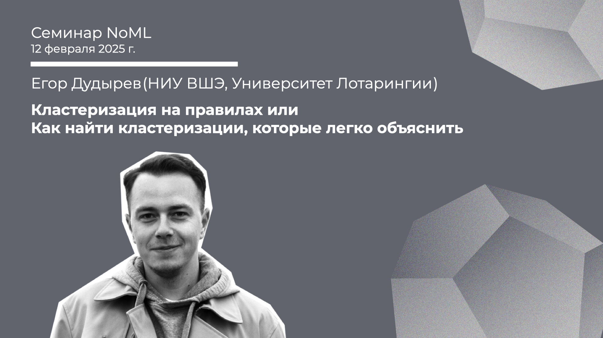

[Сообщество](/README.RU.md) | [Все мероприятия](/Events.RU.md) | [База знаний](/KB/README.RU.md)

**2025-02-12**

# Кластеризация на правилах или как найти кластеризации, которые легко объяснить

**Егор Дудырев (НИУ ВШЭ, Университет Лотарингии)**

[YouTube](https://youtu.be/L46eP_0kqBo) \| [Дзен](https://dzen.ru/video/watch/67ad82d4f2e6e64df1583b2c) \| [RuTube](https://rutube.ru/video/c3188c955dd91f78f68a7ddafefef5c4/) *(~1 час 30 минут)* \| [Слайды](2025-02-12-Dudyrev-Clustering.pdf) \| [Код](NoML_Clustering_12Feb.ipynb)

## Семинар про кластеризацию на базе анализа формальных понятий

*Выступает*: **Егор Дудырев** (НИУ ВШЭ, Университет Лотарингии)

*Тема*: Кластеризация на правилах или как найти кластеризации, которые легко объяснить

*Аннотация*

В этом докладе мы рассмотрим пайплайн кластеризации на правилах, где каждый кластер задаётся простым, легко читаем условием. В случае с числовыми данными, такие условия будут выглядеть как: "объект x находится в кластере y если значение его 1-го признака x1 лежит в интервале [a, b], а значение десятого признака x10 – в интервале [c, d]".  

Предложенный пайплайн ставится в противовес к "традиционному" подходу к кластеризации – где всё внимание уделяется расстоянию между объектами из разных кластеров. Из-за чего появляются кластера, которые трудно интерпретировать. Ведь даже чтобы объяснить, почему объект х лежит в кластере y, нужно нужно сначала посчитать расстояние в многомерном (часто, масштабированном) пространстве между x и всеми кластерами.

Семинар будет построен на основе статьи ["Clustering with Stable Pattern Concepts"](https://fca4ai.hse.ru/mirror/pubs/share/direct/974862483.pdf) (предварительная публикация) представленной на воркшопе FCA4AI проходившем в рамках Европейской Конференции по ИИ (ECAI) в октябре 2024 года.

Мы рассмотрим пайплайн состоящий из трёх шагов:
1. как найти хорошие "стабильные" паттерны в данных, которые могут использованы в качестве описаний кластеров;
2. как объединить отдельные кластеры в кластеризации: т.е. как скомбинировать кластеры так, чтобы они покрывали (почти) все данные и при этом (почти) не пересекались;
3. и как из множества найденных кластеризаций выбрать одну наилучшую.

Вторая часть доклада будет посвящена обсуждению алгоритма комбинирования кластеров из шага 2: этот алгоритм получился довольно простым, при этом он содержит множество техник, эффективных для решения комбинаторных задач на бинарных данных.

*Уровень сложности*: **продвинутый**, для понимания доклада необходимо базовое представления о задаче кластеризации. В ходе доклада будут использованы термины из областей Frequent Itemset Mining и Subgroup Discovery, поэтому знакомство с этими областями может помочь, но совсем не обязательно. Наконец, рассматриваемый алгоритм является оптимизированной версией обхода графа в ширину, так что он будет полезен людям, знающим базу теории графов.  

*Ключевые слова*: Clustering, Formal Concept Analysis, Pattern Structures, Rare Itemset Mining.

## Recap про FCA

Перед завтрашним семинаром можно посмотреть предыдущие доклады Егора:
* Егор Дудырев, Неформальное введение в Анализ Формальных Понятий, 2024. [YouTube](https://youtu.be/G6C-dYcWL44) | [Дзен](https://dzen.ru/video/watch/6699f622b627576429d221f2) | [RuTube](https://rutube.ru/video/0884502309dacbe20e86bf7f4299c073/) *(~1 час 30 минут)*;
* Егор Дудырев, Модели человеческих знаний, или Когда простейшие правила работают на уровне градиентных бустингов, 2023. [YouTube](https://youtu.be/PsxEaj8SjJs) | [Дзен](https://dzen.ru/video/watch/674201b506e4e66adc3dc262) | [RuTube](https://rutube.ru/video/437f9d40f55b5dbdae4eca6633d2bacb/) *(~1 час 10 минут)*.

## Про FCA для кластеризации и не только

В дополнение к докладу на прошлой неделе Егор рекомендует несколько статей от других команд, работающих над схожими задачами.

Две статьи про кластеризации от коллег из Ля Рошеля, которые так же разрабатывают теорию узорных структур (eng. Pattern Structures) : 
* [Boukhetta S., Trabelsi M., Formal Concept Analysis for Trace Clustering in Process Mining](https://link.springer.com/chapter/10.1007/978-3-031-40960-8_7), at ICCS 2023;
* [Waffo Kemgne M. et al., Fuzzy and Overlapping Communities Detection: An Improved Approach Using Formal Concept Analysis](https://link.springer.com/chapter/10.1007/978-3-031-78548-1_3), at ASONAM 2024.

Две статьи от коллег из университета Артуа, где кластеризацию и бинарную классификацию решают через SAT солверы:
* [Ben Hassine M. et al, On the Discovery of Conceptual Clustering Models Through Pattern Mining](https://ebooks.iospress.nl/doi/10.3233/FAIA240672), at ECAI 2024;
* [Hidouri A. et al., On the Learning of Explainable Classification Rules through Disjunctive Patterns](https://ieeexplore.ieee.org/abstract/document/10849467), at ICTAI 2024.

В этой статье можно найти подробный обзор символьных подходов к кластеризации:
* [Pérez-Suárez A. et al., A review of conceptual clustering algorithms](https://link.springer.com/article/10.1007/s10462-018-9627-1), in Artificial Intelligence Review, 2018.

Напоследок, в этой статье ниже можно найти множество техник и алгоритмов для оптимизации переборов описаний на бинарных данных:
* [Szathmary L. et al., A fast compound algorithm for mining generators, closed itemsets, and computing links between equivalence classes](https://link.springer.com/article/10.1007/s10472-013-9372-8), in Annals of Mathematics and AI, 2014.