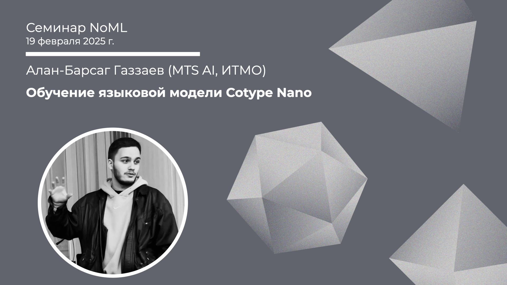

[Сообщество](/README.RU.md) | [Все мероприятия](/Events.RU.md) | [База знаний](/KB/README.RU.md)

**2025-02-19**

# Обучение языковой модели Cotype Nano

**Алан-Барсаг Газзаев (MTS AI, ИТМО)**

[YouTube](https://youtu.be/EmbB1OmJ09c) \| [Дзен](https://dzen.ru/video/watch/67b6123cc3a1c73b89218dba) \| [RuTube](https://rutube.ru/video/5e1ef51525878ca73261715a3bffa04e/) *(~35 минут)* \| [Слайды](2025-02-19-Gazzaev-CotypeNano.pdf)

## Семинар про модель Cotype Nano от MTS AI

*Выступает*: **Алан-Барсаг Газзаев**, разработчик-исследователь в MTS AI, магистрант второго курса в ИТМО

*Тема*: Обучение языковой модели Cotype Nano

*Аннотация*

Языковые модели развиваются стремительным образом. В то же время, они занимают очень много ресурсов для обучения и для инференса. Поэтому, одним из важных трендов в NLP является тренд на уменьшение размеров языковых моделей. Современные модели размером от 0.5B параметров превосходят в производительности старые LLM размеров в 7 и 14 миллиардов параметров. И мы обучили одну из них. В докладе мы затронем процесс обучения модели Cotype Nano, который несколько месяцев был лидером в своей весовой категории, а также расскажем про квантизацию этой модели

*Уровень сложности*: **начинающий/средний**, для понимания доклада будет достаточно базовых знаний по NLP

*Ключевые слова*: LLM, NLP, Supervised Fine-tuning, Data Generation, Data Preparation

