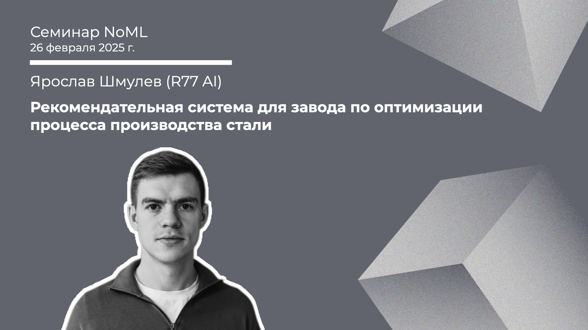

[Сообщество](/README.RU.md) | [Все мероприятия](/Events.RU.md) | [База знаний](/KB/README.RU.md)

**2025-02-26**

# Рекомендательная система для завода по оптимизации процесса производства стали

**Ярослав Шмулев (R77 AI)**

[YouTube](https://youtube.com/live/aaj56YUjLQQ) \| [Дзен](https://dzen.ru/video/watch/67bff87f4fc8f21cd39feff5) \| [RuTube](https://rutube.ru/video/9b454f2c0fd94054ba3aa2963e242ecc/) *(~1 час 10 минут)* \| [Слайды](2025-02-26-Shmulev-Steel.pdf)

## Семинар про оптимизацию сталеварения

*Выступает*: **Ярослав Шмулев**, Cofounder / CTO R77 AI (@r77_ai)

*Тема*: Рекомендательная система для завода по оптимизации процесса производства стали

*Аннотация*

На семинаре будет рассмотрен кейс оптимизация потребления ферросплавов в конвертерном цехе для снижения затрат при производстве стали высокого качества. В ходе доклада будет представлен подход реализации рекомендательного сервиса на базе моделей машинного обучения.

*Уровень сложности*: **начинающий**

*Ключевые слова*: предиктивная аналитика, ML, прогнозирование временных рядов, оптимизация, рекомендации, сталеварение, металлургия

## Про ML в металлургии

Статьи, которые упоминал Ярослав в докладе на прошлой неделе:
* [Помощник сталевара: для чего металлургам нужно машинное обучение?](https://habr.com/ru/companies/jetinfosystems/articles/567842/) 2021 *(~9 минут)*;
* [Про внедрение ИИ в сталелитейную компанию и борщ](https://vc.ru/life/1406369-pro-vnedrenie-ii-v-staleliteinuyu-kompaniyu-i-borsh), 2024 *(~9 минут)*.

Telegram канал R77 AI: @r77_ai