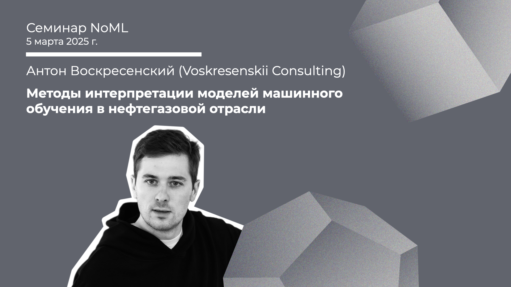

[Сообщество](/README.RU.md) | [Все мероприятия](/Events.RU.md) | [База знаний](/KB/README.RU.md)

**2025-03-05**

# Методы интерпретации моделей машинного обучения в нефтегазовой отрасли

**Антон Воскресенский (Voskresenskii Consulting)**

[YouTube](https://youtube.com/live/7oqTJSm_7gs) \| [Дзен](https://dzen.ru/video/watch/67c96db0acf11d21ded60afc) \| [RuTube](https://rutube.ru/video/171daca9628100bc9e5027a0bd6c006b/) *(~1 час 10 минут)* \| [Слайды](2025-03-05-Voskresenskii-OilGas.pdf)

## Семинар про интерпретацию моделей ML для нефтегазовой отрасли

*Выступает:* **Антон Воскресенский**, Founder / CEO Voskresenskii Consulting (@voskresenskiiconsulting)

*Тема:* Методы интерпретации моделей машинного обучения в нефтегазовой отрасли

*Аннотация*

На семинаре разберем кейсы интерпретации моделей машинного обучения для нефтегазовой отрасли и инженерии признаков с опорой на экспертные знания. Рассмотрим:
* Модели для прогнозирования временных рядов
* Методы заполнения пропущенных данных
* Подходы к поиску схожих объектов
Каждый метод будет представлен с вводной по предметной области.

*Уровень сложности:* **продвинутый**

*Ключевые слова:* интерпретация моделей ML, прогнозирование временных рядов, каротажные кривые, взаимовлияние скважин, нефтегаз

## Материалы

Пара статей:

* [N. Bukhanov, M. Subbotina, A. Voskresenkiy, K. Katterbauer, Geological and dynamic similarity for reservoir state prediction by well connectivity](https://www.sciencedirect.com/science/article/abs/pii/S294989102400037X), 2024.
* [S.M. Lundberg, Su-In Lee, A unified approach to interpreting model predictions](https://proceedings.neurips.cc/paper/2017/hash/8a20a8621978632d76c43dfd28b67767-Abstract.html), 2017.