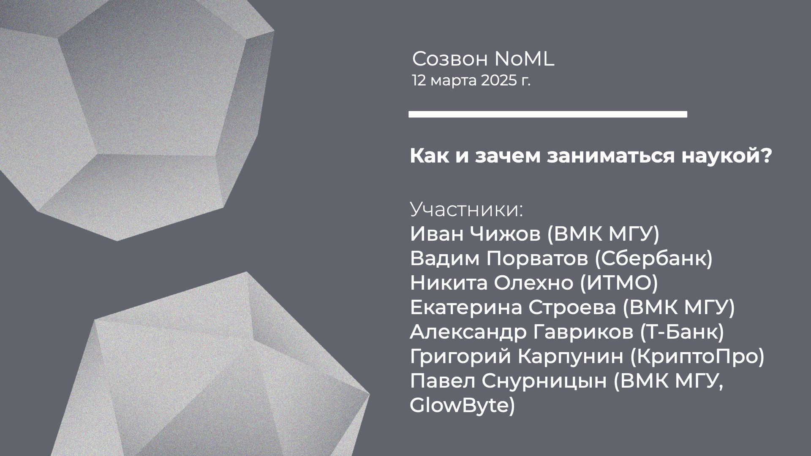

[Сообщество](/README.RU.md) | [Все мероприятия](/Events.RU.md) | [База знаний](/KB/README.RU.md)

**2025-03-12**

# Созвон: Как и зачем заниматься наукой?

**Иван Чижов (ВМК МГУ), Вадим Порватов (Сбербанк), Никита Олехно (ИТМО), Екатерина Строева (ВМК МГУ), Александр Гавриков (Т-Банк), Григорий Карпунин (КриптоПро), Павел Снурницын (ВМК МГУ, GlowByte)**

[YouTube](https://youtu.be/5w4hBEVZtQg) \| [Дзен](https://dzen.ru/video/watch/67d4372751bb336e0cf8928d) \| [RuTube](https://rutube.ru/video/000e0f5e91e6f973e7527a64bda1477a/) *(~1 час 40 минут)* 

## Созвон о том как и зачем заниматься наукой

*Вопросы к обсуждению:*
* Как выбрать тему для исследований? Какая задача подойдет для начала? Начинать ли с небольших и технических задач, или сразу строить стратегические планы по решению крупных научных проблем? Как понять, что выбранная задача по силам, и что делать, если продвижения замедлились. Как эффективнее всего освоить ключевые классические результаты в выбранной области, и как следить за свежими результатами и развитием исследований по своей теме?
* Зачем писать статьи? Как понять, что полученный результат достоин публикации? Как выбрать научный журнал для публикации? Как писать научные тексты, чем в целом этот жанр отличается от других? На что обратить внимание при написании курсовой/диплома/диссертации/…? Какие еще есть способы участия в жизни научного сообщества: конференции, коллаборации, рецензирование, …?
* Зачем идти в аспирантуру, писать диссертацию и получать учёную степень? Зачем вообще заниматься наукой? Какие могут быть варианты развития карьеры в науке? Какие есть особенности финансирования и как работать с системой грантов?

## Про инструменты

На созвоне мы обсуждали помимо прочего какие инструменты могут помочь с анализом текущего потока научных публикаций, вспоминали что есть, например
* [Connected Papers](https://www.connectedpapers.com/)
* [Papers with Code](https://paperswithcode.com/)
* ну и ChatGPT и т.д. для суммаризаций

## Про то что всё тлен

На созвоне мы также пришли к выводу, что наукометрия и бездушные суммаризации — это всё тлен, а наукой надо заниматься из эстетических и высших соображений)

В этой связи я упоминал книгу сборник статей
* [И.Р. Шафаревич, О науке](https://biblio.mccme.ru/node/197843), 2023

Вот пара цитат из предисловия А.Н. Паршина:
* *“И.Р. очень любил разные биологические аналогии, о чем мы уже говорили, и если саму математику можно сравнить с живым организмом, то, мне кажется, ее современное развитие, как оно оформляется, сравнимо с развитием внутри этого организма злокачественной опухоли. Вот два факта. Во-первых, бюрократия требует ей подчиниться и втягивает вас в свой процесс, и часть людей с удовольствием вовлекается. Опухоль же — это не бесформенное аморфное образование, она активно заставляет организм работать на себя, прорастает сосудами, которые являются не ее частью, а частью организма, безропотно ей подчиняющегося. Во-вторых, загадкой злокачественного роста является то, что в итоге опухоль, выступающая как паразит, убивает своего хозяина, погибая и сама, то есть не получая от своей деятельности никакой конечной выгоды. Если экстраполировать все это на бюрократию и ее методы (рейтинги, ПРНД, баллы, отчеты и т.д.), станет ясно, что она в итоге весьма эффективно сужает поле смысла, той содержательной доли, чем мы занимаемся, увеличивая то, чем можно просто отчитаться. Понятно, что это удушение, если оно и впредь будет продолжаться сколь угодно долго, и науку придушит, и само уничтожится, так как ему будет не на чем паразитировать. Впрочем, процесс этот может продолжаться весьма долго, приведя к блестящему снаружи виду науки и сгнившему нутру.”*
* *“Внутри математики, по всей видимости, нельзя найти ее цель, и, следовательно, она должна быть вовне. И. Р. предлагает рассмотреть религиозную деятельность человека как образец более высокой деятельности человечества, которая может быть либо стимулом, либо объяснением того, к чему движется развитие математики. Он завершает свое выступление таким тезисом, выделенным крупным шрифтом: обрести высшую религиозную цель и смысл культурной деятельности человечества. При этом чуть выше он предлагает обратиться к Античности, ко времени союза пифагорейцев, о котором хотя и имеются только отрывочные свидетельства, но из которого, как мы понимаем, пришло само математическое знание, тесно соединявшееся у пифагорейцев с их религиозными представлениями.”*

И прямые ссылки на две статьи Шафаревича, которые есть в начале этого сборника:
* [И.Р. Шафаревич, О некоторых тенденциях развития математики](https://www.mathnet.ru/links/a0254442a343095608fed76c3652bd8d/mo562.pdf), 1973
* [И.Р. Шафаревич, Математическое мышление и природа](https://www.mathnet.ru/links/643853247a3774bb942b3bdbcf94fec8/mo287.pdf), 1994