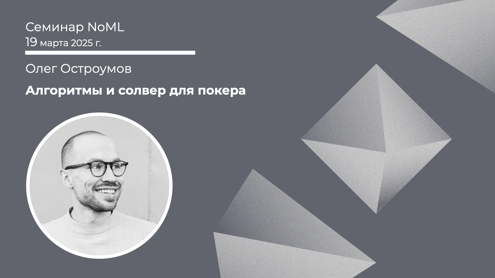

[Сообщество](/README.RU.md) | [Все мероприятия](/Events.RU.md) | [База знаний](/KB/README.RU.md)

**2025-03-19**

# Алгоритмы и солвер для покера

**Олег Остроумов**

[YouTube](https://www.youtube.com/live/QClsTcnDA38) \| [Дзен](https://dzen.ru/video/watch/67dbc37db479d92c437f9e4d) \| [RuTube](https://rutube.ru/video/bad3e7ddeb4818502e2a779a11d6cd99/) *(~1 час 20 минут)* 

## Семинар про теорию игр и покер

*Выступает:* **Олег Остроумов**

*Тема:* Алгоритмы и солвер для покера

*Аннотация*

В докладе расскажу:
* Как я перешёл от профессиональной игры в покер к созданию солвера для покера, и помог моим клиентам стать лучшими игроками в мире.
* Как работает алгоритм Counterfactual Regret Minimization для вычисления равновесия Нэша в покере.
* Что на самом деле означает блеф в покере и как рассчитать оптимальную частоту блефа.
* Как помочь игрокам изучить и понять оптимальную стратегию, ведь массив из 80 ГБ чисел запомнить нельзя.
* Как я продавал свой продукт игрокам, которые изначально сомневались в его точности.

*Уровень сложности:* **продвинутый**, для понимания доклада требуется знакомство с теорией игр.

*Ключевые слова:* Poker, Extensive form game, Imperfect information game, Nash Equilibrium, (Monte-Carlo) Counterfactual Regret Minimization.

## Материалы

Подборка материалов от Олега Остроумова @OLEGSOLVERS:
* История Олега про создание солвера: https://www.gipsyteam.ru/news/24-01-2023/oleg-ostroumov-kak-ya-sozdal-i-prodaval-pervyy-v-mire-solver-dlya-pokera 
* Counterfactual Regret Minimization: https://poker.cs.ualberta.ca/publications/NIPS07-cfr.pdf 
* Monte-Carlo CFR: https://mlanctot.info/files/papers/colt_ws_mccfr.pdf 
* DeepStack (нейронные сети для покера): https://arxiv.org/abs/1701.01724 
* Навороченная книга с расчетами равновесий Нэша в покере вручную: https://www.pokerbooks.lt/books/en/The_Mathematics_of_Poker.pdf 
* Статья, как обыграли профессионалов в покере на 6 человек: https://www.science.org/doi/10.1126/science.aay2400 

Существующие солверы для покера:
* holdem.olegsolvers.com
* monkerware.com
* gtowizard.com

ТГ-канал Олега: @oleg_ostroumov