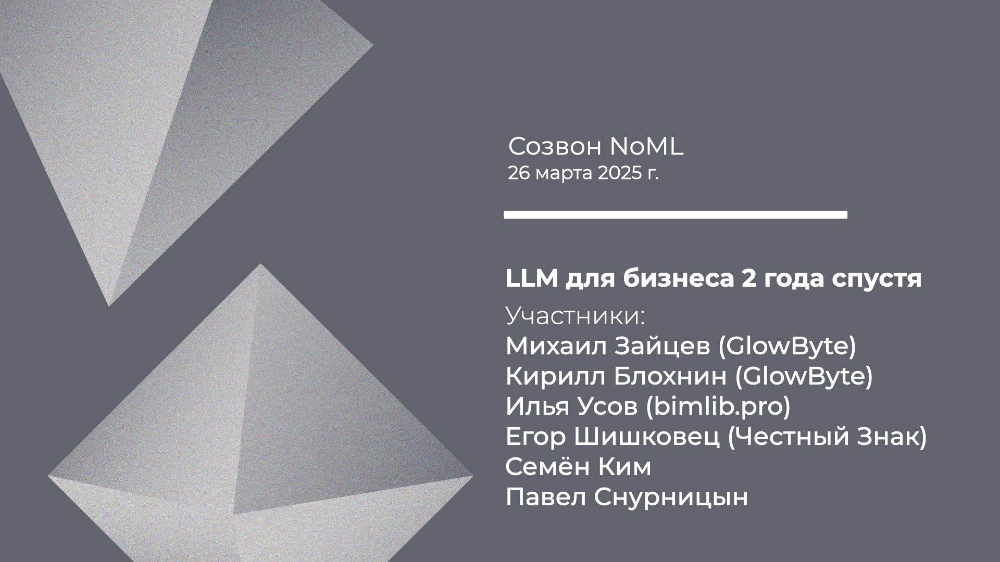

[Сообщество](/README.RU.md) | [Все мероприятия](/Events.RU.md) | [База знаний](/KB/README.RU.md)

**2025-03-26**

# Созвон: LLM для бизнеса 2 года спустя

**Михаил Зайцев (GlowByte), Кирилл Блохнин (GlowByte), Илья Усов (bimlib.pro), Егор Шишковец (Честный Знак), Семён Ким, Павел Снурницын**

[YouTube](https://youtu.be/F2QLWGHa5RI) \| [Дзен](https://dzen.ru/video/watch/67e448a23d115e695889667b) \| [RuTube](https://rutube.ru/video/503f824a3acc7b6290df83e09848d971/) *(~1 час 25 минут)*

## Созвон про LLM

*Тема:* LLM для бизнеса 2 года спустя

*Вопросы к обсуждению:*
* Какие есть реальные кейсы и бизнес задачи, решение которых опирается на LLM?
* Есть ли примеры неудачного внедрения технологии и какие уроки можно из них извлечь?
* В каких индустриях и направлениях уже есть стандартные бизнес-кейсы приложений LLM, а где технология только набирает обороты?
* Какие организационные и технические особенности необходимо учесть при реализации проектов на базе LLM в крупных компаниях? 
* Как крупные компании оценивают ROI от внедрения LLM?
* В каких случаях кастомизация и тюнинг моделей имеет преимущество по сравнению с использованием готовых сервисов?
* Имеет ли смысл начинать проекты с LLM если ресурсы GPU ограничены?
* Почему Gartnet пишет про тренд Small Language Models?
* Как сейчас решаются вопросы безопасности и конфиденциальности данных при использовании LLM?
* Где грань между полной автоматизацией процессов и необходимостью участия человека?
* Может ли LLM стать основой для создания полностью автономных бизнес-процессов?
* Какой новый функционал может радикально изменить подход к использованию LLM в будущем?

