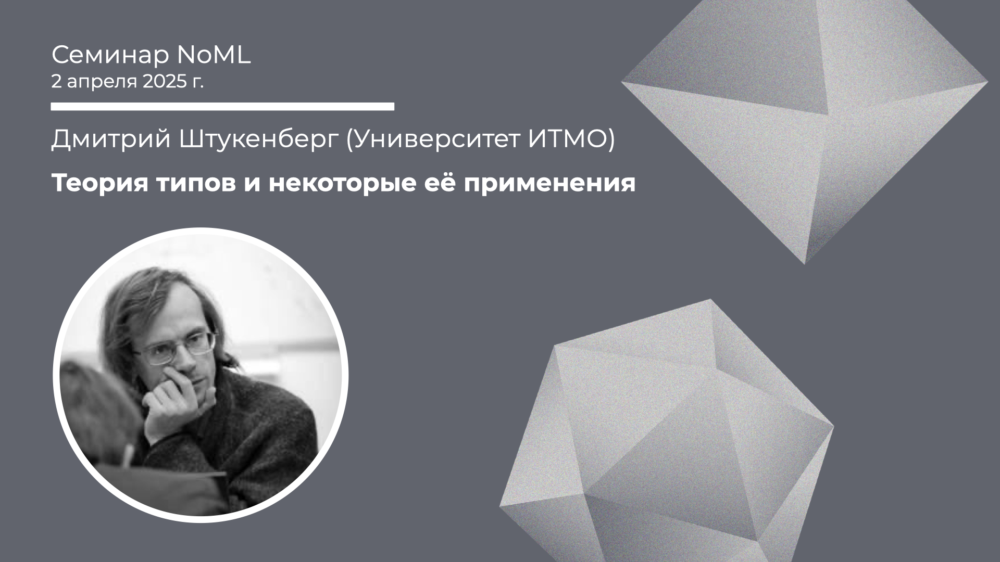

[Сообщество](/README.RU.md) | [Все мероприятия](/Events.RU.md) | [База знаний](/KB/README.RU.md)

**2025-04-02**

# Теория типов и некоторые её применения

**Дмитрий Штукенберг (ИТМО)**

[YouTube](https://youtube.com/live/5rtRVu-tYaY) \| [Дзен](https://dzen.ru/video/watch/67eda6d71ac8d55cc93115ad) \| [RuTube](https://rutube.ru/video/2864687be52f1ea79a18e5f24adfec1b/) *(~1 час 10 минут)* \| [Слайды](2025-04-02-Shtukenberg-Type.pdf)

## Семинар про теорию типов

*Выступает:* **Дмитрий Штукенберг** (Университет ИТМО)

*Тема:* Теория типов и некоторые её применения

*Аннотация*

Данная встреча будет посвящена теории типов: области информатики, пограничной между математической логикой и программированием. Эта область связана с использованием изоморфизма Карри-Ховарда, предлагающего рассматривать типы значений как логические утверждения, а сами значения - как доказательства этих утверждений.

Подход имеет многочисленные применения - как в вопросах, полезных для программирования (например, он важен для дизайна языков программирования), так и в математике (дополнительные подходы к  формализации математических утверждений и теорий).

На встрече мы обсудим как теоретическую составляющую, так и конкретные практические применения.

*Уровень сложности:* **начинающий**, каких-то специальных знаний для понимания материала встречи не требуется, должно быть достаточно общей математической эрудиции.

*Ключевые слова:* математическая логика, теория типов, изоморфизм Карри-Ховарда.

## Про теорию типов

Подборка материалов от Дмитрия Штукенберга.

**Введение в основания математики**
* S.C. Kleene, Introduction to Metamathematics, 1952 (перевод: С.К. Клини, Введение в метаматематику, 1957) (~550 стр.)

**Теория типов**
* Хорошее введение в тему: интуиционисткая логика, изоморфизм Карри-Ховарда, линейная логика и как всё это связано с функциональным программированием: [P. Wadler, A Taste of linear Logic](https://homepages.inf.ed.ac.uk/wadler/papers/lineartaste/lineartaste-revised.pdf), 1993 (27 стр.)
* Здесь в целом про конструктивную математику для программирования: [P. Martin-Löf,  Constructive mathematics and computer programming](https://www.cs.tufts.edu/~nr/cs257/archive/per-martin-lof/constructive-math.pdf), 1982 (23 стр.)
* Гомотопическая теория типов (HoTT) и вообще один из современных взглядов в сторону оснований математики, плюс в первой главе хорошее введение в целом в теорию типов: [Homotopy Type Theory: Univalent Foundations of Mathematics](https://homotopytypetheory.org/book/), 2013 ([перевод](https://henrychern.wordpress.com/wp-content/uploads/2022/10/hott2.pdf)) (475 стр.)
На ресурсе [homotopytypetheory.org](https://homotopytypetheory.org/references/) можно найти много других материалов про HoTT.

**Языки и инструменты**
* [Coq / Rocq](https://rocq-prover.org/);
Плюс учебник: [A. Chipala, Certified Programming with Dependent Types: A Pragmatic Introduction to the Coq Proof Assistant](http://adam.chlipala.net/cpdt/), 2013–2019 (~400 стр.)
* [Agda](https://wiki.portal.chalmers.se/agda/pmwiki.php)
* [F* (F star)](https://fstar-lang.org/)
* [Arend](https://arend-lang.github.io/)
И список [библиотек и расширений на базе HoTT](https://ncatlab.org/nlab/show/formalized+libraries+of+homotopy+type+theory)

Пара интересных приложений
* Задача о четырёх красках: [G. Gonthier, A computer-checked proof of the Four Colour Theorem](https://www2.tcs.ifi.lmu.de/~abel/lehre/WS07-08/CAFR/4colproof.pdf), 2005 (57 стр.)
* Верификатор для Solidity: [coq-of-solidity](https://github.com/formal-land/coq-of-solidity)