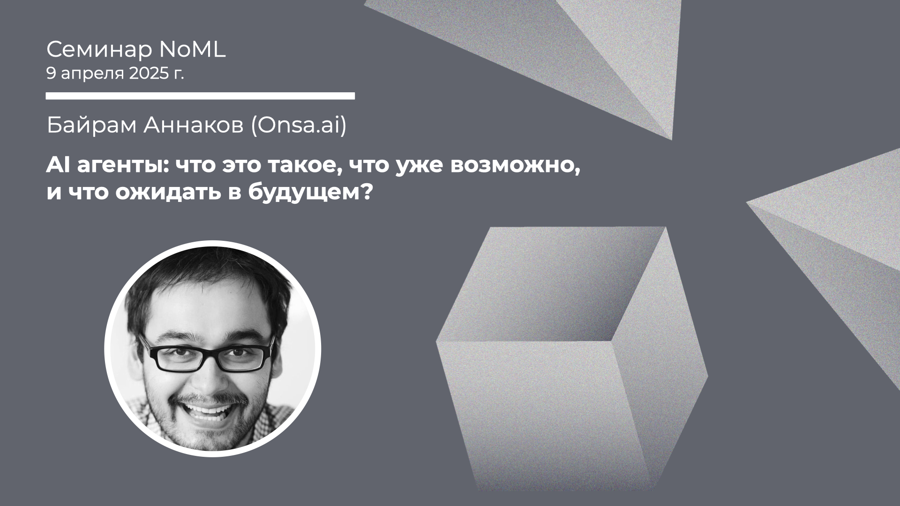

[Сообщество](/README.RU.md) | [Все мероприятия](/Events.RU.md) | [База знаний](/KB/README.RU.md)

**2025-04-09**

# AI агенты: что это такое, что уже возможно, и что ожидать в будущем?

**Байрам Аннаков (Onsa)**

[YouTube](https://youtube.com/live/71J-mmTzVUM) \| [Дзен](https://dzen.ru/video/watch/67f8ce2e5b806b32544586ea) \| [RuTube](https://rutube.ru/video/f2b93fd6d04fe4fbbf1d1f443481ecd6/) *(~1 час 25 минут)* \| [Слайды](2025-04-09-Annakov-AIAgents.pdf)

## Семинар про ИИ агентов

*Выступает:* **Байрам Аннаков**, @ProductsAndStartups, фаундер и CEO Onsa.ai

*Тема:* AI агенты: что это такое, что уже возможно, и что ожидать в будущем?

*Аннотация*

На семинаре обсудим:
* Что такое AI агенты?
* Фреймворк "Чувствовать —> Думать —> Действовать" — что уже умеют LLM?
* Что ожидать от AI агентов в будущем и как к этому подготовиться?

*Уровень сложности:* **начинающий**.

*Ключевые слова:* LLM, AI-агенты.

## Про AI

По следам семинара пара рекомендаций материалов от докладчика:
* Книга: [D. Patel, G. Leech, The Scaling Era: An Oral History of AI](https://www.amazon.com/Scaling-Era-Oral-History-2019-2025/dp/1953953557), 2019–2025 (~250 стр.);
* Подкаст: [Francois Chollet - Why The Biggest AI Models Can't Solve Simple Puzzles](https://www.youtube.com/watch?v=UakqL6Pj9xo), 2024 (~1 час 35 минут).

Ещё много всего есть в Telegram-канале Байрама: @ProductsAndStartups.
Также Байрам приглашает на свой курс [AI Product Engineer](https://t.me/ProductsAndStartups/1156) (курс платный), до воскресенья еще можно записаться.