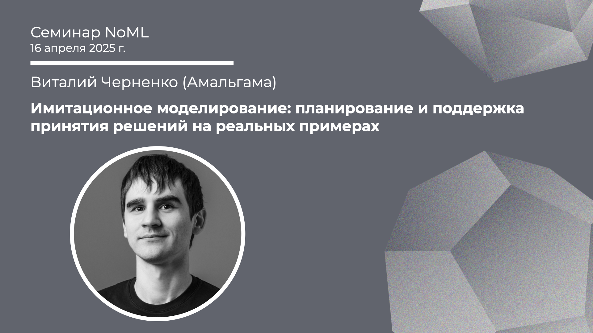

[Сообщество](/README.RU.md) | [Все мероприятия](/Events.RU.md) | [База знаний](/KB/README.RU.md)

# Имитационное моделирование: планирование и поддержка принятия решений на реальных примерах

**Виталий Черненко (Амальгама)**

[YouTube](https://youtube.com/live/LVBEX5l97RA) \| [Дзен](https://dzen.ru/video/watch/6803b248c712ee314d9b1321) \| [RuTube](https://rutube.ru/video/59e262174726de82ecc3827416202d79/) *(~1 час 50 минут)* | [Слайды](2025-04-16-Chernenko-SM.pdf)

## Семинар про имитационное моделирование

*Выступает:* **Виталий Черненко (Амальгама)**

*Тема:* Имитационное моделирование: планирование и поддержка принятия решений на реальных примерах

*Аннотация*
Имитационное моделирование (ИМ) — это не метод оптимизации, а методология анализа сложных систем, сравнения сценариев и поддержки принятия решений. В отличие от многих методов оптимизации, ИМ позволяет учитывать высокий уровень детализации процессов ценой отказа от достижения математически оптимального решения.
В ходе выступления мы познакомимся с принципами и приемами имитационного
моделирования. Рассмотрим понятия события, временной оси, случайных величин, агентов в ИМ.
Также обсудим популярные инструменты AnyLogic, Simio и Amalgama Platform, их возможности и ограничения.
На реальных кейсах ведущих компаний покажем, как ИМ помогает в принятии решений:
* Оптимизация запасов и логистики в Diageo;
* Цифровой двойник и алгоритм управления кранами в Норильском Никеле;
* Моделирование горнодобывающего производства с помощью MineTwin.

*Уровень сложности:* начинающий

*Ключевые слова:* Имитационное моделирование / Simulation Modeling, цифровые двойники, поддержка принятия решений

## Про имитационное моделирование

**Материалы конференций**

Доклады, статьи, а также хорошие туториалы (особенно в WSC):
* [ИММОД](http://simulation.su/). 15–17 октября 2025 г. Санкт-Петербург [ИММОД-2025](http://simulation.su/static/ru-immod-2025.html).
* [WSC (WinterSim)](https://informs-sim.org/). 7–10 декабря 2025, Seattle, WA [WSC-2025](https://meetings.informs.org/wordpress/wsc2025/).

**Книга**

Для систематического изучения темы ИМ:
* [A.M. Law, Simulation Modeling and Analysis (6th Ed.)](https://www.averill-law.com/simulation-book/), 2024 (~680 стр.)

**Статья про валидацию**
* [O. Balchi, Principles and Techniques of Simulation Validation, Verification, and Testing](https://dl.acm.org/doi/pdf/10.1145/224401.224456), 1995 (~25 минут, 8 стр.)

**Бизнес-кейсы**

Помимо материалов упомянутых выше конференций, большое количество кейсов применения можно найти в блогах вендоров и платформ, например, у коллег:
* [Амальгама — Кейсы](https://amalgamasimulation.ru/materials/).

**Инструменты: вендоры и платформы**
* [Amalgama Platform](http://www.platform.amalgamasimulation.com/);
* [AnyLogic](https://www.anylogic.com/);
* [Simio](https://www.simio.com/);
* [Simudyne](https://simudyne.com/);
* [Arena](https://www.rockwellautomation.com/es-mx/products/software/arena-simulation.html);
* [Hash](https://hash.ai/).

**Инструменты: open source**
* [SimPy](https://simpy.readthedocs.io/en/latest/);
* [Mesa](https://mesa.readthedocs.io/stable/);
* [Simmer](https://r-simmer.org/);
* [repast](https://repast.github.io/);
* [NetLogo](https://ccl.northwestern.edu/netlogo/);
* [SimJulia](https://simjuliajl.readthedocs.io/en/stable/).