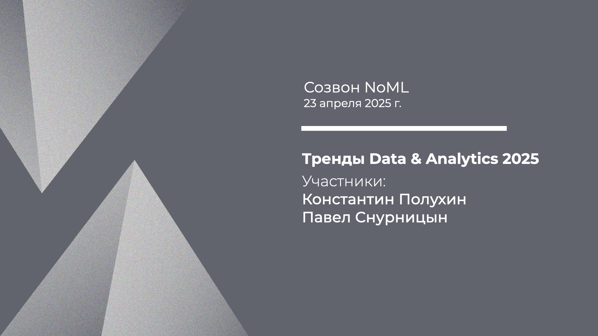

[Сообщество](/README.RU.md) | [Все мероприятия](/Events.RU.md) | [База знаний](/KB/README.RU.md)

**2025-04-23**

# Созвон: Тренды Data & Analytics 2025

**Константин Полухин, Павел Снурницын**

[YouTube](https://youtu.be/b7pf0lc2Jx0) \| [Дзен](http://dzen.ru/video/watch/680df428eaab1b4f8cb6e896) \| [RuTube](https://rutube.ru/video/190923a91f1cdf081c0f5683984312e7/) *(~1 час 25 минут)*

* [Аннотация](#созвон-про-тренды-da-2025)
* [Вместо протокола](#про-тренды-da-2025)

## Созвон про тренды D&A 2025

Традиционное ежегодное обсуждение трендов в области данных и (продвинутой) аналитики.

Разберёмся, о чем пишет Gartner:
* [Gartner Identifies Top Trends in Data and Analytics for 2025](https://www.gartner.com/en/newsroom/press-releases/2025-03-05-gartner-identifies-top-trends-in-data-and-analytics-for-2025);

Заглянем в Stanford State of AI:
* [The 2025 AI Index Report](https://hai.stanford.edu/ai-index/2025-ai-index-report);

И может быть вспомним, что обсуждали год назад здесь в NoML:
* Часть I: [YouTube](https://youtu.be/7dowXCT3aJA) | [Дзен](http://dzen.ru/video/watch/6742130ea8ac0b5e15680d85) | [RuTube](https://rutube.ru/video/f0e6b71dbf90b5bebfef6f8b63c1bda2/) *(~1 час 50 минут)*,
* Часть II: [YouTube](https://youtu.be/LXggsagT4mY) | [Дзен](http://dzen.ru/video/watch/6741f6b9e8efdb64d45a0f4a) | [RuTube](https://rutube.ru/video/6cfcff7f246658f27346500c8e36aa8a/) *(~1 час 20 минут)*,
* Часть III: [YouTube](https://youtu.be/P-_hyqSDYTw) | [Дзен](http://dzen.ru/video/watch/6806a77ada80085ea9dc1df3) | [RuTube](https://rutube.ru/video/3c4e0567d8f9a079e8df9cd103a7a336/) *(~1 час 25 минут)*.

## Про тренды D&A 2025

Мысли после обсуждения трендов Gartner ([Top Trends in Data and Analytics for 2025](https://www.gartner.com/en/newsroom/press-releases/2025-03-05-gartner-identifies-top-trends-in-data-and-analytics-for-2025)).

**Highly Consumable Data Products.** Здесь продукт — это результаты анализа данных, а потребитель — бизнес заказчик, принимающий решения на базе этого анализа. Поэтому такой Data-продукт должен: 
* быть на языке потребителя-заказчика;
* иметь форму, которую заказчик легко трансформирует в конкретные действия и решения;
* уметь быстро адаптироваться к изменениям (и “доставляться”);
* масштабироваться и переиспользоваться на уровне всей организации.

**Metadata Management Solutions (& Multimodal Data Fabric).** Про важность управления метаданными на всех уровнях, как техническом, так и уровне бизнес контекста, уже сказано очень много слов. Здесь хочется подсветить, что вообще описываемые Gartner тренды очень плотно связаны между собой, например, тяжело представить реализацию практик Highly Consumable Data Products в среде, где нет никакого управления данными и метаданными.

**Agentic Analytics.** Мы будем наблюдать, как концепция агентности будет распространяться от (Gen)AI на практики данных и аналитики в целом. Общепринятый термин агентной аналитики пока не устоялся, но уже можно примерно представлять основные характеристики:
* агент-ассистент/помощник: не просто показать отчет или прогноз, а предложить варианты действий и принимаемых решений;
* проактивный агент: формирование тригеров, запускающих последующие цепочки анализа данных и принятия решений;
* автономный агент: частичное или полное принятие решений по результатам анализа данных на уровне самого агента;
* адаптивный агент: способность реагировать на изменения распределений и дрифты в наблюдаемых данных и среде;
* …
* агентная архитектура: представление сложных процессов принятия решений на базе анализа данных набором агентов, решающих отдельные подзадачи.

**Composite AI.** “… diversify beyond GenAI or LLMs, incorporating data science, machine learning, knowledge graphs, and optimization …”, то есть ровно то, что мы тут продвигаем в NoML: бизнес задачи часто оказываются слишком сложны, чтобы для них можно было получить хорошее решение одним (трендовым) методом (таким как LLM/GenAI). Можно ещё вспомнить доклад конца прошлого года: Максим Гончаров, Павел Снурницын, Not only ML или Почему в эру ИИ не стоит забывать о классических методах мат. моделирования. [YouTube](https://youtu.be/rB2XhyJByLA) | [Дзен](https://dzen.ru/video/watch/676c5ed1bdc355605f26d6f8) | [RuTube](https://rutube.ru/video/02e539012b6dcf2087ea9727cdc792bb/) *(~1 час 55 минут)*, в котором мы как раз описали такой композитный фреймворк интеллекта принятия решений, который помимо прочего включает:
* ML для прогнозирования откликов среды;
* классические математические модели (например, дифференциальные уравнения) для более точного описания среды;
* методы мат. оптимизации для учёта всех ограничения и их зависимостей между собой;
* имитационное моделирование для анализа того, что никогда не наблюдалось;
* Process Mining для анализа самих процессов принятия решений, и их оптимизации;
* графовые вероятностные модели для установления истинных причинно-следственных связей и скрытых зависимостей;
* …
* ну и экспертные бизнес правила над всеми этими моделями пока никто не отменял.

**Decision Intelligence Platforms.** Платформа как система, которая позволяет организовать работу с данными, классической аналитикой, моделями во всех аспектах композитности перечисленных выше и в конечном счете управлять и процессами принятия решений, и изменением этих процессов. Я бы вообще композитность и агентность относил бы к общим практикам Decision Intelligence. Понятно также, что хорошие Decision Intelligence практики и платформа невозможны без хороших Data практик и платформы. В статье кстати написано про переход от data-driven к decision-centric, но на мой взгляд между этими терминами надо ставить не “vs.” а “and”, то есть вообще имеет место формула: Data&Metadata Management + Decision Intelligence = Highly Consumable Data Products (и вообще качественные Data продукты).