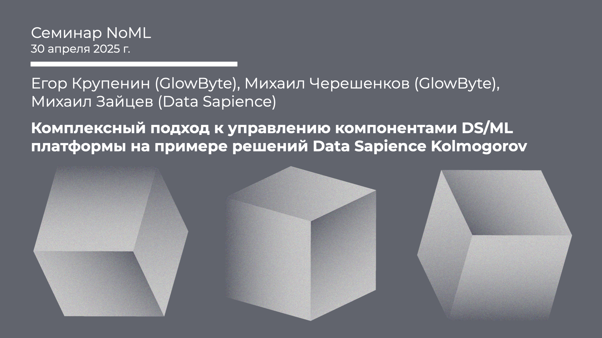

[Сообщество](/README.RU.md) | [Все мероприятия](/Events.RU.md) | [База знаний](/KB/README.RU.md)

**2025-04-30**

# Комплексный подход к управлению компонентами DS/ML платформы на примере решений Data Sapience Kolmogorov

**Егор Крупенин (GlowByte), Михаил Черешенков (GlowByte), Михаил Зайцев (Data Sapience)**

[YouTube](https://youtube.com/live/ZtbsN8Hee3Y) | [Дзен](https://dzen.ru/video/watch/68137a9fa3b58679bb1a4bff) | [RuTube](https://rutube.ru/video/43d228a0ab69edb7afc4c0461a43b327/) *(~50 минут)*

 

 ## Семинар про композитную DS/ML платформу

 *Выступают*: **Егор Крупенин** (GlowByte), **Михаил Черешенков** (GlowByte), **Михаил Зайцев** (Data Sapience)

*Тема*: Комплексный подход к управлению компонентами DS/ML платформы на примере решений Data Sapience Kolmogorov

*Аннотация*

Современная DS/ML(Ops) платформа не ограничивается организацией рабочего места специалистов по анализу данных и технического стека для обеспечения вывода моделей в промышленную эксплуатацию. Такая платформа живет в контексте, во-первых, данных и метаданных, доступных для анализа и построения моделей, во-вторых, бизнес задач и процессов принятия решений. Более того, решение бизнес задач является композитным, часто состоит из нескольких моделей и типов моделей (ML, LLM, мат. оптимизация, имитационное моделирование, дифференциальные уравнения ….), а промышленный процесс принятия решений на базе таких моделей — это каскады связанных data-пайплайнов автоматических расчетов и workflow-процессов с участием человека. Таким образом, пользователями такой платформы становятся не только специалисты DE/DS/ML/AI/OR но и эксперты со стороны бизнеса. На семинаре расскажем, как может выглядеть архитектура такого вида платформы и покажем пример реализации этой архитектуры в решениях Kolmogorov от Data Sapience.

*Уровень сложности*: **начинающий**, доклад будет полезен специалистам MLOps, а также разработчикам и архитекторам, которые сталкивались с вызовами построения больших корпоративных композитных DS/ML платформ.

*Ключевые слова*: MLOps, ModelOps, DS/ML платформа, управление моделями, модельный риск, MRM, аналитические приложения.

## Recap про Kolmogorov AI

Все доклады от коллег из GlowByte и Data Sapience про платформу и решения Kolmogorov:

* Михаил Зайцев, Григорий Шутов, Евгений Вилков, Платформа для DS/ML Kolmogorov, 2024. [YouTube](https://youtu.be/IRY2bWIaGVY) | [Дзен](https://dzen.ru/video/watch/669b59b6f11d201c92aefd2e) | [RuTube](https://rutube.ru/video/f6ae201148d05a90eed4bb7b79864520/) *(~1 час 20 минут)*;

* Михаил Зайцев, Федеративный подход к мониторингу прогнозных и оптимизационных моделей на базе Kolmogorov Predicate, 2024. [YouTube](https://youtu.be/2BZkLTc1wxM) | [Дзен](https://dzen.ru/video/watch/6741e2b41117a85da7db3d1d) | [RuTube](https://rutube.ru/video/6ddfdc79bb20cda2b982ce16fd5b6def/) *(~40 минут)*;

* Максим Гончаров, Вазген Амбарцумов, Управление промо-календарём на базе методов прогнозной и оптимизационной аналитики, пример на платформе Kolmogorov, 2023. [YouTube](https://youtu.be/eZE_nWnBtw0) | [Дзен](https://dzen.ru/video/watch/67420167b9a44d0f056aca8b) | [RuTube](https://rutube.ru/video/bf832729296051cc09b93eb692320ef9/) *(~1 час 55 минут)*;

* Вадим Глухов, Альфия Харламова, Решения Kolmogorov ABacus & Continuity для A/B тестов, 2023. [YouTube](https://youtu.be/nfJkSZM90TI) | [Дзен](https://dzen.ru/video/watch/674213c9ca74f40671ef15a5) | [RuTube](https://rutube.ru/video/fde1ed4edf8add2efaf717ad33ae5fcb/) *(~50 минут)*;

* Дмитрий Забавин и др., Kolmogorov AI для A/B, 2023. [YouTube](https://youtu.be/NV7dJV_MAK4) | [Дзен](https://dzen.ru/video/watch/67422c7aa8ac0b5e158ac803) | [RuTube](https://rutube.ru/video/db09d4d26cc33f1dd0fb11b063ceb5c4/) *(~3 часа 20 минут)*;

* Василь Султанов (Росбанк), Михаил Зайцев, Cистема управления моделями, System of Model Management (SyMoMa), 2022. [YouTube](https://youtu.be/VOqquEmXY5c) | [Дзен](https://dzen.ru/video/watch/675d6903d8fb625d811ef0a2) | [RuTube](https://rutube.ru/video/c730b1e993d8e5a3b84c5896aec0f8ea/) *(~1 час 10 минут)*.
