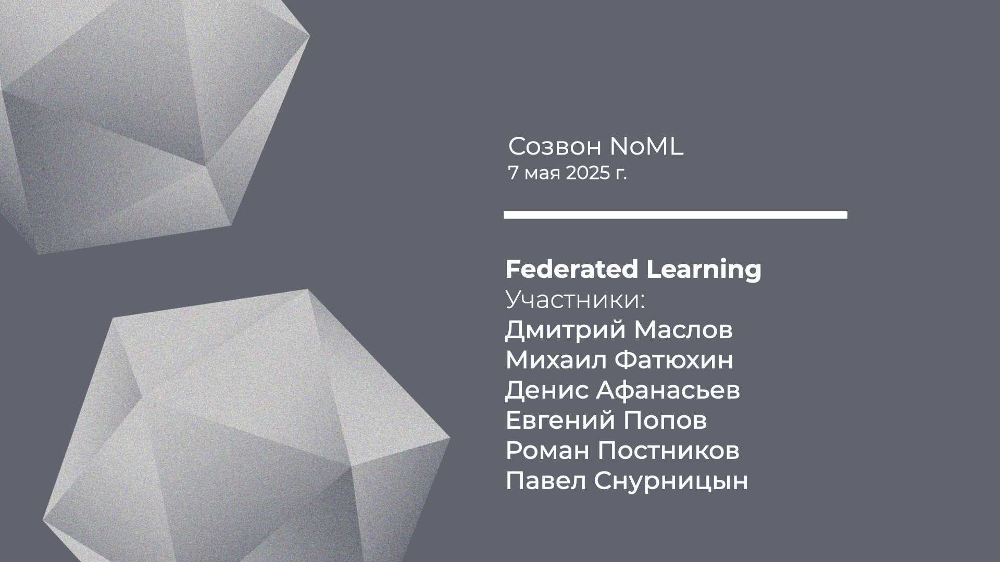

[Сообщество](/README.RU.md) | [Все мероприятия](/Events.RU.md) | [База знаний](/KB/README.RU.md)

**2025-05-07**

# Созвон: Federated Learning и конфиденциальный анализ данных

**Дмитрий Маслов, Михаил Фатюхин, Денис Афанасьев, Евгений Попов, Роман Постников, Павел Снурницын**

[YouTube](https://youtu.be/JpApLfde38I) | [Дзен](https://dzen.ru/video/watch/6820f8ad299a2d186a9f0b8b) | [RuTube](https://rutube.ru/video/4feeead3035a80bc8d3bc405d281fab3/) *(~1 час 25 минут)*

* [Аннотация](#созвон-про-федеративное-обучение)
* [Вместо протокола](#мысли-про-fl-и-ppml-по-мотивам-созвона)
* [Материалы](#дополнительные-материалы-про-fl-и-конф-вычисления)
 

## Созвон про федеративное обучение

Вместе с коллегами из компании Guardora **Михаилом Фатюхиным** и **Дмитрием Масловым** обсудим текущее положение дел с адаптацией технологий федеративного обучения (FL) в enterprise-среде:
* Напомним основные термины, определения и подходы из FL;
* Перечислим перспективные бизнес-кейсы применения этой технологии в различных индустриях и направлениях;
* Разберём основные угрозы безопасности и модель рисков связанных с FL;
* Рассмотрим другие методы обеспечения конфиденциальности процессов анализа данных и их связь с федеративным обучением;
* Поговорим про правовые аспекты использования технологий конфиденциального анализа данных и текущее положение дел в области их регулирования;
* Обсудим, какие есть преграды перед широким внедрением технологий FL и конфиденциальных вычислений для решения бизнес-задач.

Перед созвоном можно ознакомиться с отчётом (white paper) от Ассоциации больших данных, Guardora и Privacy Advocates:
[Конфиденциальные вычисления и доверенные среды исполнения. Federated Learning](https://lib.rubda.ru/public/fl-multiparty-computation.html), 2025 *(~35 минут)*.

## Мысли про FL и PPML по мотивам созвона

Саммари созвона от **Дениса Афанасьева**:

* [Денис Афанасьев, Федеративное обучение: потенциал, ограничения и экономические реалии внедрения](https://habr.com/ru/articles/909014/) *(4 минуты)*.

Дополнительные мысли:

* Потенциальных бизнес-кейсов объединения данных разных участников много, но оценить эффект от такого объединения заранее очень сложно, а то, что для бизнес-заказчика выглядит как пилот по FL (или другим методам конфиденциальной аналитики), на самом деле является непростым технологическим проектом.

* Вообще ожидания от объединения данных разных владельцев обычно сильно преувеличены. Более того, если говорить про кейсы на табличных (структурированных) данных, то прямое объединение в лоб скорее всего ничего не даст, важны понимание бизнес смысла данных и интеллектуальный feature engineering над объединенными данными. Например, в тех же задачах антифрода большой прирост даёт анализ графа связей и расчет графовых признаков, а в случае федеративных и конфиденциальных вычислений, когда у разных участников есть только локальные части глобального графа, а глобальный граф никто не видит, эта задача непростая (но решаемая).

* В контексте (финансовых) эффектов от объединения данных возникает еще вопрос ценообразования при использовании данных от разных владельцев. Ведь сами по себе данные стоимости не имеют (более того несут затраты: их надо хранить, накапливать и защищать), а стоимость всегда будет зависеть от конкретного бизнес-кейса. Получается, что стоимость может иметь инференс, а задача технологических провайдеров как раз в том, чтобы научиться справедливо разделять и транслировать эту стоимость от поставщиков данных к потребителям.

* В целом если вспоминать разделение на горизонтальное федеративное обучение (HFL) и вертикальное (VFL), то область enterprise кейсов применения FL для безопасной коллаборации данных будет двигать VFL: объединение разных признаков для одного наблюдения, объединение признаков и целевого события, опять же федеративный feature engineering и контроль качества данных, …

* Можно выделить такие два направления задач, которые исследуются в FL:
    - FL для массовых распределенных вычислений на устройствах. Причем бывают ситуации, в которых вопросы конфиденциальности вообще остаются за кадром, а важна именно эффективность вычислений на локальных и глобальных сегментах этих устройств (телефоны, беспилотный транспорт, рои дронов и т.д.). Особенности: большое количество устройств (десятки тысяч — миллионы), небольшие наборы данных на каждом устройств, ограничения на доступность устройств и топологию их связности. Здесь одна из основных задач: гарантировать сходимость методов обучения.
    - FL для безопасной агрегации данных. В бизнес кейсах применения таких как скоринг или антифрод всё наоборот: небольшое количество участников (десятки), большие датасеты у каждого из участников, и можно считать что инфраструктура участников доступна 24/7. А для обеспечения конфиденциальности потребуется связка FL + что-то еще: FHE, MPC, дифференциальная приватность.

* Для PPML, включая FL, можно выделить такие основные технические сценарии:
    - Обогащение данных, и в более широком смысле обогащение информации. Я бы сюда включил и кейс федеративной валидации моделей, т.е. когда модель именно валидируется, а не дообучается на данных одного или нескольких участников.
    - Изоляция данных от разработчиков моделей.
    - Разделение данных и сред обучения/исполнения.

* Само по себе FL не является средством криптографической защиты информации (СКЗИ). Но для табличных бизнес-кейсов может сработать аргументация, что компрессия данных в передаваемых весах и градиентах настолько высока, что конфиденциальных данных там точно нет. С другой стороны, есть, например, атаки, направленные на восстановления целевой переменной, да и истории про атаки на FL на неструктурированных данных у всех на слуху. А когда в схему добавляется частичное или полное гомоморфное шифрование, то это уже криптография, причём такая, для которой пока нет стандартов.

## Дополнительные материалы про FL и конф. вычисления

На созвоне упоминались следующие материалы:

* [Евгений Попов, Что такое федеративное обучение: метод, который приведет к взрывному росту искусственного интеллекта](https://www.techinsider.ru/technologies/1677577-chto-takoe-federativnoe-obuchenie-metod-kotoryi-privedet-k-vzryvnomu-rostu-iskusstvennogo-intellekta/), 2025 *(~7 минут)*.

* *Stalactite — опенсорс фреймворк для VFL от ИТМО и Сбера: [GitHub](https://github.com/sb-ai-lab/Stalactite), [пресс-релиз](https://news.itmo.ru/ru/startups_and_business/partnership/news/13991/) и материалы конференции ACM RecSys ’24: [A. Zakharova et al., Stalactite: toolbox for fast prototyping of vertical federated learning systems](https://dl.acm.org/doi/abs/10.1145/3640457.3691700), 2024 *(~10-20 минут)*.

* Отчёты-описания по направлениям и технологиям PPML от [Ассоциации Больших Данных](http://rubda.ru/):
    - Общее: [Технологии защищенной обработки данных: от защиты данных — к развитию ИИ, партнерским отношениям и экосистемной экономике](https://lib.rubda.ru/public/tekhnologii-zashchishchennoj-obrabotki-dannyh1.html), 2024 *(~30 минут)*;
    - Крипто-анклавы: [Конфиденциальные вычисления и доверенные среды исполнения](https://lib.rubda.ru/public/tekhnologii-zashchishchennoj-obrabotki-dannyh2.html), 2024 *(~30 минут)*;
    - MPC: [Конфиденциальные вычисления и доверенные среды исполнения. Secure Multiparty Computation](https://lib.rubda.ru/public/secure-multiparty-computation.html), 2025 *(~30 минут)*;
    - FL: [Конфиденциальные вычисления и доверенные среды исполнения. Federated Learning](https://lib.rubda.ru/public/fl-multiparty-computation.html), 2025 *(~30 минут)*.

Предыдущие мероприятия сообщества по теме:

* Евгений Попов, Никита Лазарев, Юрий Маркин, Практический опыт применения FL в медицине на примере обучения модели по классификации ЭКГ-синдромов, 2024. [YouTube](https://youtu.be/lACZk15hUb8) | [Дзен](https://dzen.ru/video/watch/66d0a1e348695e3387dccfea) | [RuTube](https://rutube.ru/video/f15475d79a95c07611f946825c432690/) *(~1 час 35 минут)*;

* Денис Афанасьев, Федеративное обучение: обзор методов, платформ и трендов, 2024. [YouTube](https://youtu.be/eD3KngY_tM8) | [Дзен](https://dzen.ru/video/watch/669b7506eb82615474b94cbe) | [RuTube](https://rutube.ru/video/8f841f1db5cd25fa61aeba01e7ceb516/) *(~1 час 20 минут)*;

* Денис Афанасьев, Таксономия методов FL, обзор платформ, основных игроков, вызовов и трендов развития, 2023. [YouTube](https://youtu.be/g14cVjUxNlE) | [Дзен](https://dzen.ru/video/watch/66d09fa6a6fec84560d347e2) | [RuTube](https://rutube.ru/video/42f7336b7675cf0d4b022129f40ca6bd/) *(~1 час 20 минут)*;

* Созвон: Роман Постников, Павел Снурницын, Александр Григорьевский, Андрей Соколов, Методы конфиденциальной аналитики, 2023. [YouTube](https://youtu.be/lACZk15hUb8) | [Дзен](https://dzen.ru/video/watch/66d0a1e348695e3387dccfea) | [RuTube](https://rutube.ru/video/f15475d79a95c07611f946825c432690/) *(~1 час 50 минут)*;

* Роман Постников, Максим Воеводский, Upgini: Библиотека для поиска и обогащения ML моделей релевантными внешними фичами, 2023. [YouTube](https://youtu.be/-KuvxJXJDqk) | [Дзен](https://dzen.ru/video/watch/66d0a116cfdd4f4c6c75446d) | [RuTube](https://rutube.ru/video/976c3846cfb6ca4672b8c8f29640fea5/) *(~1 час 25 минут)*.

