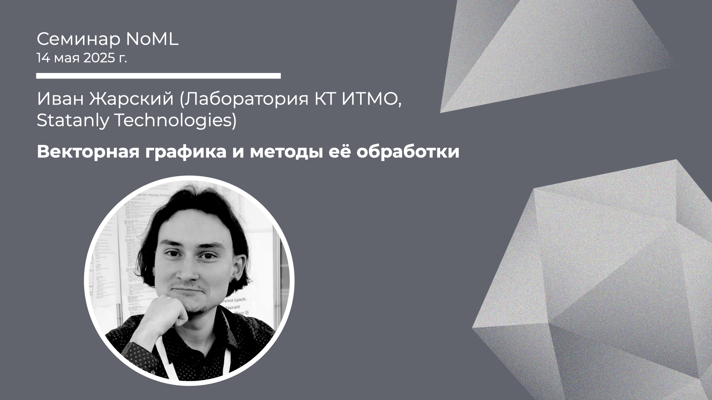

[Сообщество](/README.RU.md) | [Все мероприятия](/Events.RU.md) | [База знаний](/KB/README.RU.md)

**2025-05-14**

# Векторная графика и методы её обработки

**Иван Жарский (Лаборатория КТ ИТМО, Statanly Technologies)**

 [YouTube](https://youtube.com/live/1xjOgUClKyw) \| [Дзен](https://dzen.ru/video/watch/682a3939e844b5325a302d30) \| [RuTube](https://rutube.ru/video/0c74dd1123164e8a94bc8e62d0fc78ec/) *(~1 час 55 минут)* | [Слайды](2025-05-14-Zharsky-Vector.pdf)

 

 ## Семинар про векторную графику

*Выступает*: **Иван Жарский** (Лаборатория КТ ИТМО, Statanly Technologies)

*Тема*: Векторная графика и методы её обработки

*Аннотация*

В последнее время генерация и обработка изображений стала особенно популярной, но в основном речь идёт о растровой графике, представляемой в виде матрицы пикселей. Однако существует и другой способ — геометрико-математическое представление, лежащее в основе векторной графики. Векторная графика используется преимущественно в иконках, шрифтах, веб-дизайне, схемах и технических чертежах. Её важнейшее преимущество над растровой графикой — возможность неограниченного масштабирования без потери качества.

Векторная графика находится на пересечении трёх доменов: графического (визуальный образ), текстового (формат хранения) и кодо-математического (описание примитивов), поэтому алгоритмы работы с ней достаточно сложны в реализации. Несмотря на то, что методы её обработки пока уступают по зрелости растровым, в последние годы наблюдается заметный рост интереса к этой области.

В докладе будет рассмотрен популярный формат SVG, обсуждены подходы к обработке и генерации векторных изображений, а также процесс векторизации — преобразования растра в вектор. Также будут представлены собственные наработки лаборатории КТ ИТМО. На практике будут продемонстрированы:
* метод CLIPDraw (на базе DiffVG) для генерации SVG по тексту,
* модель IconShop для генерации по классу,
* модель VectorWeaver для безусловной генерации на основе диффузионной сети.

*Уровень сложности*: **средний**

*Ключевые слова*: векторная графика, SVG, машинное обучение, генерация изображений, NLP для графики.