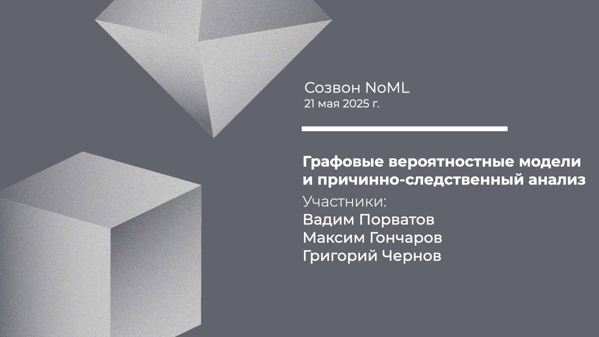

[Сообщество](/README.RU.md) | [Все мероприятия](/Events.RU.md) | [База знаний](/KB/README.RU.md)

**2025-05-21**

# Созвон: Графовые вероятностные модели и причинно-следственный анализ

**Вадим Порватов, Максим Гончаров, Григорий Чернов**

[YouTube](https://youtu.be/jxooY5Vrdiw) | [Дзен](https://dzen.ru/video/watch/6833245478a7ea7fb7f9b7f6) | [RuTube](https://rutube.ru/video/512cb65f1f13f863d94bee22253a58e9/) *(~1 час 45 минут)*

## Созвон про причинно-следственный анализ

По результатам голосования в чате сообщества на сегодня была выбрана тема причинно-следственного анализа и структурных вероятностных моделей.

* Напомним, что такое графовые вероятностные модели (PGM), какие бывают их виды (байесовские сети (BN), структурные причинные модели (SCM), …), чем они отличаются от традиционных подходов из статистики и машинного обучения и как их дополняют.
* Разберём несколько бизнес приложений этих методов и обсудим, в каких задачах их применение может дать наибольший эффект.
* Пройдемся по некоторым техническим особенностям PGM, таким, например, как: работа с данными, метрики и методы валидации, способы учёта экспертных знаний о предметной области, а также методы оценки устойчивости причинных графов к неточностям и неполноте в этих знаниях.
* Обсудим, какие возникают сложности при внедрении моделей на базе PGM в бизнес-процессы, например, как интерпретировать результаты и как объяснять выводы полученные при проведении причинно-следственного анализа нетехническим специалистам и руководителям, как помочь сконвертировать эти выводы в принятие решений, а также нужны ли в команде отдельные специалисты по PGM, или достаточно “обычных data scientist’ов”.