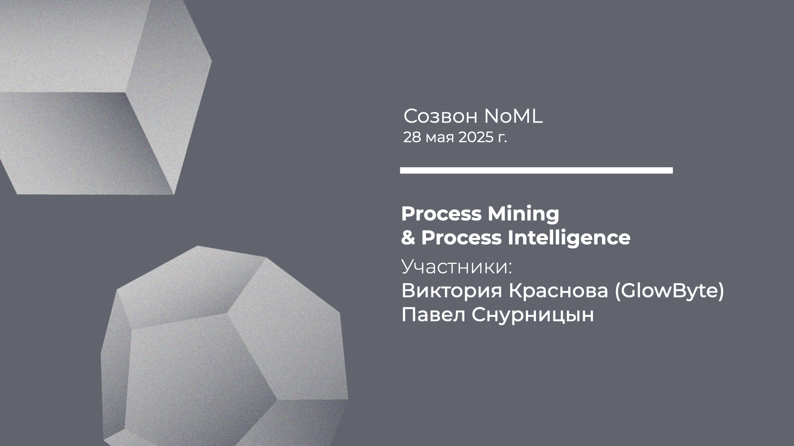

[Сообщество](/README.RU.md) | [Все мероприятия](/Events.RU.md) | [База знаний](/KB/README.RU.md)

**2025-05-28**

# Созвон: Process Mining & Process Intelligence

**Виктория Краснова (GlowByte), Павел Снурницын**

[YouTube](https://youtu.be/Gau-TZKOevw) | [Дзен](https://dzen.ru/video/watch/68397dda30622e75ada00b73) | [RuTube](https://rutube.ru/video/53690b42dc4aeda850ef8d5232c63a2b) *(~1 час)*

## Созвон про Process Mining

Мы недавно обсуждали тренды в области данных и аналитики, и среди трендов NoML отметили процессную аналитику и Process Mining (PM). При этом последний раз доклад про PM у нас был почти год назад. В связи с этим решили вместе с Викторией Красновой из GlowByte Process Intelligence обсудить эту тему.

Так что вспоминаем что такое Process Mining:
* Альфия Ибрагимова, Тимофей Прибылев, Введение в Process Mining: методы, платформы и кейсы. [YouTube](https://youtu.be/L9y-_m6YGu8) | [Дзен](https://dzen.ru/video/watch/6699f4b2ef9cc4629370a178) | [RuTube](https://rutube.ru/video/2965a551e7c3605647e9b0cdf4b19bce/) *(1 час 30 минут)*;

И готовимся обсуждать следующие вопросы:
* Какие есть новые интересные бизнес-кейсы применения процессной аналитики?
* Какие задачи решает Process Mining помимо поиска узких горлышек и отклонений в процессах?
* Как эволюционируют технологии и методы PM и что скрывается за термином Process Intelligence (PI)?
* Process Mining вместе или против других технологий: BI, имитационное моделирование, математическая оптимизация и исследование операций, причинно-следственный анализ ML/AI, …?
* Как вообще развитие ML/AI влияет на PM/PI и автоматизацию процессов?
* Нужны ли специальные навыки для работы с Process Mining, или это инструмент для бизнес-пользователей?
* Какие есть особенности и вызовы в части работы с данными в проектах PM/PI?
* Как PM встраивается в общий ландшафт интеллекта принятия решений (Decision Intelligence, DI)?
* Возможна ли полная автономия в data-driven управлении процессами?
* Как преодолеть сопротивление сотрудников при анализе и автоматизации их рабочих процессов?
* Как совместить прозрачность процессов и конфиденциальность данных сотрудников?
* Когда вся рутина будет автоматизирована ИИ, что останется для человека?