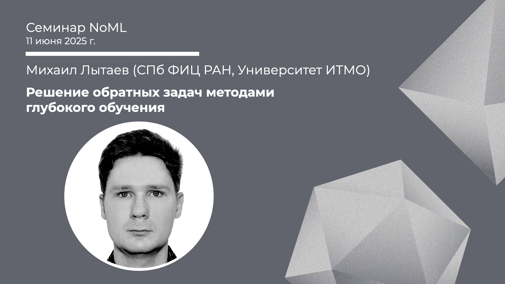

[Сообщество](/README.RU.md) | [Все мероприятия](/Events.RU.md) | [База знаний](/KB/README.RU.md)

**2025-06-11**

# Решение обратных задач методами глубокого обучения

**Михаил Лытаев (СПб ФИЦ РАН, Университет ИТМО)**

[YouTube](https://youtube.com/live/YE34r0eD8jc) | [Дзен](https://dzen.ru/video/watch/68511a828c69f062a410044b) | [RuTube](https://rutube.ru/video/285da8bf933bf5147262cb759ede7478/) *(~1 час 30 минут)* | [Слайды](2025-06-11-Lytaev-Inverse.pdf)

## Семинар про Scientific ML

*Выступает*: **Михаил Лытаев** (СПб ФИЦ РАН, Университет ИТМО)

*Тема*: Решение обратных задач методами глубокого обучения

*Аннотация*

Математическая модель позволяет прогнозировать поведение объектов, зная их параметры и параметры внешней среды. Однако зачастую настоящий интерес представляет обратная задача, т.е. определение параметров системы по наблюдаемому (или желаемому) поведению. Классическими примерами обратных задач являются медицинская визуализация, сейсмическая разведка, дистанционное зондирование. Т.е. задачи, в которых непосредственное измерение параметров объекта чрезвычайно дорого или невозможно. Вместо этого интересующие параметры (например, внутреннее строение тела или места залегания полезных ископаемых) пытаются восстановить по данным косвенных измерений. Другим примером являются задачи конструирования метаматериалов и оптимальное управление, когда нужно определить параметры системы таким образом, чтобы она обладала желаемыми свойствами.

Зачастую такие задачи не обладают никакими специальными свойствами, вроде линейности и выпуклости. Кроме того, обратные задачи относятся к классу некорректных: когда нельзя заранее сказать, имеет ли задача единственное физически адекватное решение.
Хотя обратные и некорректные задачи активно изучаются классической теорией и методами функционального анализа, все еще не хватает универсальных методов, подходящих для широкого круга задач. Существующие решения как правило носят узкоспециализированный характер.

Возникшие всего несколько лет назад методы т.н. scientific ML впервые предлагают универсальные методы решения обратных нелинейных задач, используя глубокое обучение. В докладе будут рассмотрены следующие подходы:
— нейронные операторы (DeepONet, FNO), позволяющие обучать обратный нелинейный оператор;
— физически информированные нейронные сети (PINN), позволяющие встраивать физические законы в функцию потерь;
— нейронные дифференциальные уравнения (NeuralODE), позволяющие синтезировать модели на основе дифференциальных уравнений и нейронных сетей;
— автоматическое дифференцирование численных схем, позволяющее строить солверы обратных задач на основе существующих программных реализаций решения прямой задачи.

На простых примерах покажем, как ставятся обратные задачи, в чем заключается суть их некорректность.

*Уровень сложности*: **средний**, глубоких знаний в области дифференциальных уравнений, функционального анализа и математической физики не требуется.

*Ключевые слова*: scientific ML, некорректные задачи, нелинейные операторы, нейронный оператор, нейронное дифференциальное уравнение, автоматическое дифференцирование.