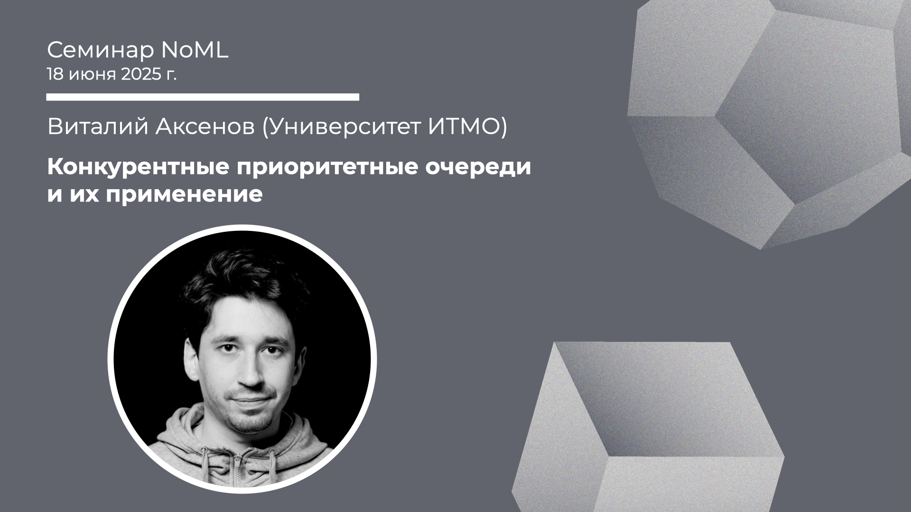

[Сообщество](/README.RU.md) | [Все мероприятия](/Events.RU.md) | [База знаний](/KB/README.RU.md)

**2025-06-18**

# Конкурентные приоритетные очереди и их применение

**Виталий Аксенов (Университет ИТМО)**

[YouTube](https://youtube.com/live/j72vDJJYq8I) | [Дзен](https://dzen.ru/video/watch/685521d95e09204dabdcfb21) | [RuTube](https://rutube.ru/video/f76ca7e513aab126f6227798dd7a49dd/) *(~1 час 10 минут)* | [Слайды](2025-06-18-Aksenov-MultiQueue.pdf)

## Семинар про многопоточную очередь

*Выступает*: **Виталий Аксенов**, доцент ИТМО, руководитель совместной лаборатории ИТМО и ВК по распределённым вычислениям и магистерской программы «Программирование и Искусственный Интеллект». Член программных комитетов SmartData и Sysconf, соорганизатор международной школы SPTDC.

*Тема*: Конкурентные приоритетные очереди и их применение

*Аннотация*

Приоритетная очередь является одной из фундаментальных структур данных. Например, она является базовым блоком в алгоритмах поиска кратчайшего пути и планировщиках с приоритетами. Чтобы ускорить эти алгоритмы, хочется использовать параллелизацию, а значит хочется иметь многопоточную версию приоритетной очереди. К сожалению, не всё так просто, так как есть явное узкое место — операция extractMin. Теория говорит, что невозможно избавиться от него и одновременно давать чёткие гарантии на операцию. Что же тогда делать?

В этом докладе мы рассмотрим идеи, которые позволяют ускорить конкурентную приоритетную очередь. Затем, мы выясним, что очередь с точными гарантиями на самом деле не всегда нужна, и, как следствие, можно ослабить требования. Как итог, мы получим быструю очередь MultiQueue, основную идею которой (choice of 2) можно использовать в других областях, например, машинном обучении.

*Уровень сложности*: **средний**.

*Ключевые слова*: многопоточность, структуры данных, приоритетная очередь.

## Материалы по теме

Ссылки в [слайдах](2025-06-18-Aksenov-MultiQueue.pdf).

Плюс: [G. Nadiradze et al, Asynchronous Decentralized SGD with Quantized and Local Updates, 2021](https://proceedings.neurips.cc/paper_files/paper/2021/file/362c99307cdc3f2d8b410652386a9dd1-Paper.pdf).