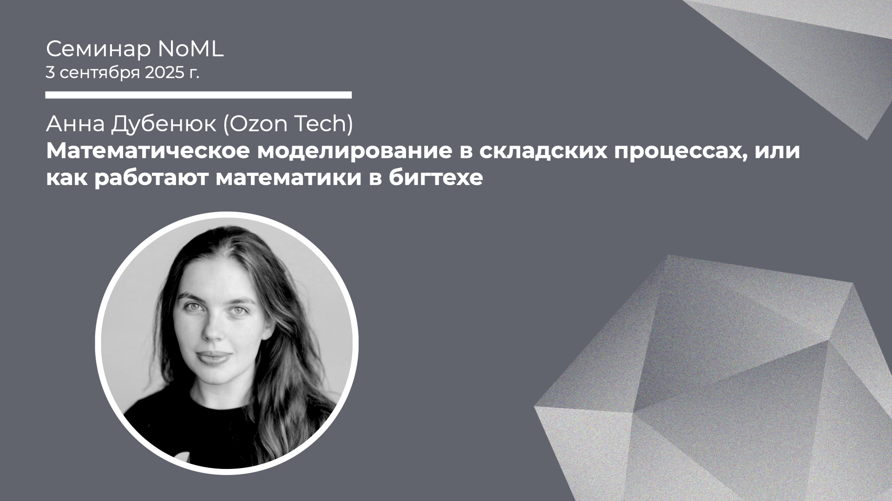

[Сообщество](/README.RU.md) | [Все мероприятия](/Events.RU.md) | [База знаний](/KB/README.RU.md)

**2025-09-03**

# Математическое моделирование в складских процессах, или как работают математики в бигтехе

**Анна Дубенюк (Ozon Tech)**

[YouTube](https://youtu.be/HIHshlZoE9E) \| [Дзен](https://dzen.ru/video/watch/68b94f0b2e90367e8dd96cf9) \| [RuTube](https://rutube.ru/video/0ba9694d2427d6984650cc6d5c88a23d/) *(~1 час 20 минут)* \| [Слайды](2025-09-03-Dubenyuk-Warehouse.pdf)

## Семинар про оптимизацию складов

*Выступает*: **Анна Дубенюк**, руководитель группы моделирования и оптимизации складских процессов в Ozon Tech, приглашенный преподаватель ФКН ВШЭ, автор канала @everything_is_eventual

*Тема*: Математическое моделирование в складских процессах, или как работают математики в бигтехе

*Аннотация*

Обзорно обсудим, как оптимизационное моделирование помогает решать важные задачи в складских процессах. Поговорим про разные виды задач, инструменты и в целом про создание IT-продуктов и работу математиков в бигтехе.

## Про математику в складских процессах

Материалы от Анны Дубенюк:

* Статья на Хабре: [Математика на складе. Как оптимизировать хаос](https://habr.com/ru/companies/ozontech/articles/904044/), 2025 *(~8 минут)*;
* Доклад на Code Fest: [Математическое моделирование на складах, или Как математика спасёт мир](https://14.codefest.ru/lecture/2485), 2024 *(~40 минут)*;
* И Telegram-канал Анны про прикладную математику: ["всё предельно"](https://t.me/everything_is_eventual).

