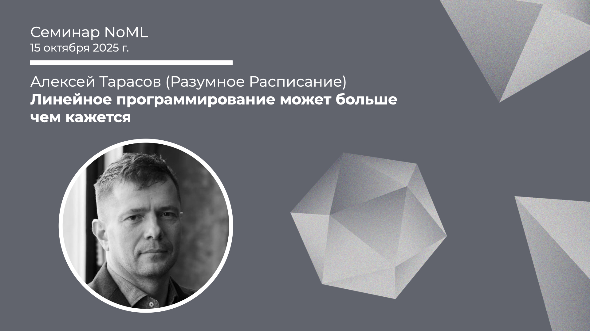

[Сообщество](/README.RU.md) | [Все мероприятия](/Events.RU.md) | [База знаний](/KB/README.RU.md)

**2025-10-15**

# Линейное программирование может больше чем кажется

**Алексей Тарасов (Разумное Расписание)**

[YouTube](https://youtu.be/oy6Yzo4o2L4) \| [Дзен](https://dzen.ru/video/watch/68f0a21c0e9b137a52ac2aec) \| [RuTube](https://rutube.ru/video/305face1f3c4cb4c4c8ddcfa40ce5703/) *(~1 час 10 минут)* 

## Семинар про линейное программирование

*Выступает:* **Алексей Тарасов**, Разумное Расписание

*Тема*: Линейное программирование может больше чем кажется

*Аннотация*

Метод ЛП имеет ограничения по скорости и размеру задач. На примере реальных кейсов я расскажу, что ограничения кажущееся и их на самом деле нет. Как Нео вы сможете уворачиваться от пуль и гнуть ложки, и как доктор Стрэндж сможете планировать сразу мультиреальность.