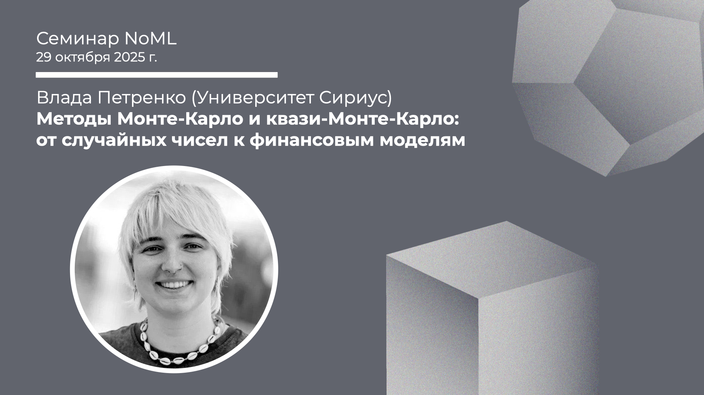

[Сообщество](/README.RU.md) | [Все мероприятия](/Events.RU.md) | [База знаний](/KB/README.RU.md)

**2025-10-29**

# Методы Монте-Карло и квази-Монте-Карло: от случайных чисел к финансовым моделям

**Влада Петренко (Университет «Сириус»)**

[YouTube](https://youtu.be/Uz0nSCv84mc) \| [Дзен](https://dzen.ru/video/watch/69038ac42317255bf38b969c) \| [RuTube](https://rutube.ru/video/4ffe3c605a7cc5960844efa39d75f81f/) *(~50 минут)* \| [Слайды](2025-10-29-Petrenko-QMC.pdf)

## Семинар про методы Монте-Карло

*Выступает*: **Влада Петренко**, аспирантка Университета «Сириус»

*Тема*: Методы Монте-Карло и квази-Монте-Карло: от случайных чисел к финансовым моделям

*Аннотация*

В докладе рассматриваются методы Монте-Карло и квази-Монте-Карло как инструменты численного моделирования. Особое внимание уделяется последовательностям с низким расхождением и понятию дискрепанси, а также их применению в финансовой математике — при оценке опционов и моделировании стохастических процессов.