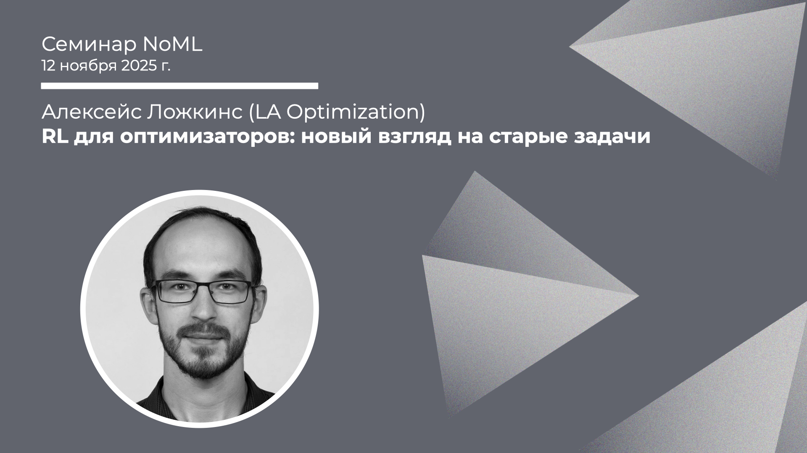

[Сообщество](/README.RU.md) | [Все мероприятия](/Events.RU.md) | [База знаний](/KB/README.RU.md)

**2025-11-12**

# RL для оптимизаторов: новый взгляд на старые задачи

**Алексейс Ложкинс (LA Optimization)**

[YouTube](https://youtu.be/Afr3Cbu5Gt4) \| [Дзен](https://dzen.ru/video/watch/691584815b80947f85646b84) \| [RuTube](https://rutube.ru/video/1121a72b2ce3bd409f0b81e4b9a8bda0/) *(~1 час 10 минут)* \| [Слайды](2025-11-12-Lozkins-RL-Opt.pdf)

## Семинар про RL для оптимизаторов

*Выступает*: **Алексейс Ложкинс**, LA Optimization, эксперт-консультант по математической оптимизации и моделированию

*Тема*: RL для оптимизаторов: новый взгляд на старые задачи

*Аннотация*

Традиционные методы исследования операций давно не обновлялись концептуально, несмотря на рост вычислительных возможностей. Способен ли современный ИИ изменить ситуацию? Разберем на примере, как метод обучения с подкреплением позволяет решать простую оптимизационную задачу.

## Про RL и RL в комбинаторной оптимизации

Пару недель назад у нас был вот такой доклад:

Алексейс Ложкинс (LA Optimization), RL для оптимизаторов: новый взгляд на старые задачи. YouTube | Дзен | RuTube (~1 час 10 минут).

К нему в догонку материалы от Алексея:

Книги:
* R.S. Sutton, A.G. Barto, Reinforcement Learning, 2018 (есть перевод);
* M. Lapan, Deep Reinforcement Learning Hands-On, 2020 (есть перевод);

Фреймворк для работы с RL алгоритмами в комбинаторной оптимизации:
* [rl4co](https://github.com/ai4co/rl4co): "A PyTorch library for all things Reinforcement Learning (RL) for Combinatorial Optimization (CO)"

Статьи с кодом:
* [VRP-RL](https://github.com/OptMLGroup/VRP-RL):
    * [M. Nazari, A. Oroojlooy, L.V. Snyder, M. Takáč, Reinforcement Learning for Solving the Vehicle Routing Problem](https://arxiv.org/abs/1802.04240v2), 2018;
* [NCO_code](https://github.com/CIAM-Group/NCO_code) - тут много всего, пара примеров:
    * [Zheng et al., Pareto Improver: Learning Improvement Heuristics for Multi-Objective Route Planning](https://ieeexplore.ieee.org/document/10259654), 2023
    * [Wang et al., Multi-objective Combinatorial Optimization Using A Single Deep Reinforcement Learning Model](https://ieeexplore.ieee.org/document/10266708), 2023.

