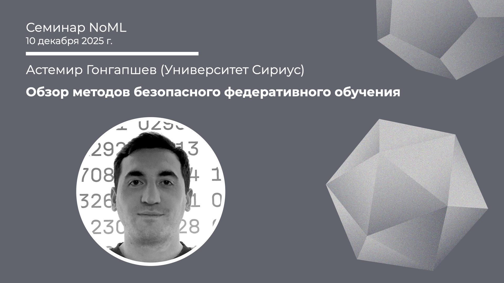

[Сообщество](/README.RU.md) | [Все мероприятия](/Events.RU.md) | [База знаний](/KB/README.RU.md)

**2025-12-10**

# Обзор методов безопасного федеративного обучения

**Астемир Гонгапшев (Университет "Сириус")**

[YouTube](https://youtu.be/AC30D5un3Vc) \| [Дзен](https://dzen.ru/video/watch/693fe323bc126a04cb1d2577) \| [RuTube](https://rutube.ru/video/e5e25edde9327c61b4e6b16767f67683/) *(~1 час)* \| [Слайды](2025-12-10-Gongapshev-FL.pdf)

## Семинар про FL

*Выступает*: **Астемир Гонгапшев**, Университет "Сириус"
 
*Тема*: Обзор методов безопасного федеративного обучения

*Аннотация*

Доклад посвящён актуальным методам обеспечения безопасности в федеративном обучении. В качестве примеров будут рассмотрены гомоморфное шифрование, дифференциальная приватность и другие решения.