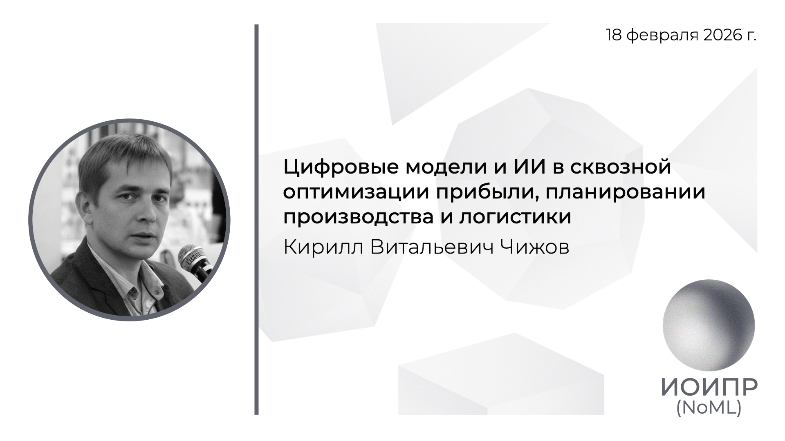

[Сообщество](/README.RU.md) | [Все мероприятия](/Events.RU.md) | [База знаний](/KB/README.RU.md)

**2026-02-18**

# Цифровые модели и ИИ в сквозной оптимизации прибыли, планировании производства и логистики

**Кирилл Витальевич Чижов**

[YouTube](https://youtu.be/1zkwlr0RFv8) \| [Дзен](https://dzen.ru/video/watch/699805336e5d715d977f1ca3) \| [RuTube](https://rutube.ru/video/65f2173c3e6e5f4982199ebd325ca61c/) \| [Файл](https://disk.yandex.ru/i/b2cqYy9AGHHupQ) *(~2 часа)* \| [Презентация](2026-02-18-Chizhov.pdf)

## Аннотация доклада

Доклад посвящен практическому построению и внедрению цифровых моделей на базе оптимизационной математики и динамической симуляции в крупных промышленных компаниях. Рассматривается, как организовать сбор данных от бизнес-подразделений и контрагентов, как выявлять и формировать отсутствующие, но критически необходимые для моделирования данные, и как формализовать бизнес-логику компании в виде исполняемых правил и ограничений внутри цифровой модели. Затронем вопросы как превратить неформальные договоренности, методологии планирования и «экспертные правила» в воспроизводимый расчетный контур.

В докладе разбираются два практических кейса.
Первый кейс — FMCG ведущего производителя напитков: дизайн и редизайн цепей поставок, оптимизация материальных потоков и совокупных затрат при множестве ограничений по производственным линиям, страховым запасам, вместимости складов, транспортным плечам и частотам, сервисным уровням и ограничениям по клиентам.
Второй кейс — крупный металлургический холдинг в фазе активного роста через M&A: внедрение расчетного ядра для интегрированного бизнес-планирования с регулярным полным пересчетом всех зависимостей и поиском оптимального плана по прибыли с учетом технологических диапазонов непрерывных агрегатов, налоговых формул, социальных ограничений на загрузку мощностей, ограничений по транспорту и хранению, а также альтернативных ценовых сценариев сделок.

Отдельный блок посвящен организационным, методологическим и инженерным проблемам построения цифровых моделей всего бизнеса: управлению качеством и полнотой данных, жизненному циклу моделей, устройству проектной работы, архитектуре корпоративного расчетного стека, задачам для ИИ и практическому пути от отдельных моделей к связной цифровой модели компании и дальнейшему движению к цифровому двойнику. 

Ключевые темы:
Проектирование и изменение цепей поставок как задача оптимизации структуры сети, размещения мощностей и потоков;
интегрированное бизнес-планирование как согласование продаж, производства, снабжения, запасов и финансов в одном расчетном контуре; оптимизационные модели как инструмент выбора наилучших решений при большом числе ограничений и альтернатив; динамическая симуляция как проверка реализуемости планов и устойчивости к сбоям; архитектура корпоративной цифровой модели и путь к цифровому двойнику бизнеса.