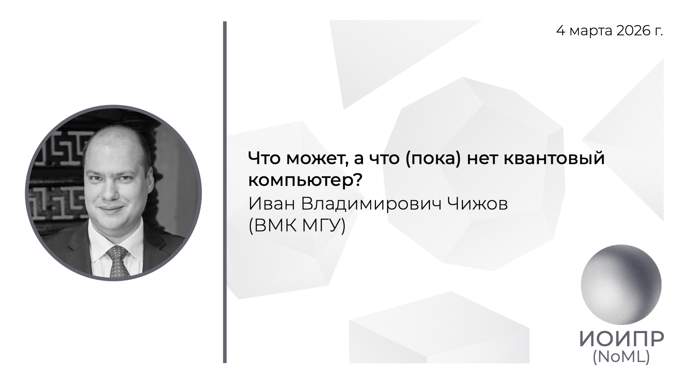

[Сообщество](/README.RU.md) | [Все мероприятия](/Events.RU.md) | [База знаний](/KB/README.RU.md)

**2026-03-04**

# Что может, а что (пока) нет квантовый компьютер?

**Иван Владимирович Чижов**, к.ф.-м.н, доцент кафедры ИБ ВМК МГУ имени М.В. Ломоносова

[YouTube](https://youtu.be/QkqL5DwS4ao) \| [Дзен](https://dzen.ru/video/watch/69abe5f714c4182ff7595087) \| [RuTube](https://rutube.ru/video/10b2fd3b28bfd291f9ab6f661e82cc44/) \| [Файл](https://disk.yandex.ru/i/EGun2CRybZWzWA) *(~2 часа 50 минут)* \| [Презентация](2026-03-04-Chizhov.pdf)

## Аннотация доклада

В докладе будет дано введение в квантовые вычисления. Рассмотрим понятие квантового алгоритма, его отличие от классического. Изучим основные квантовые алгоритмы: алгоритм Дойча-Йожи, алгоритм факторизации и дискретного логарифмирования Шора, а также алгоритм Гровера. Постараемся ответить на вопрос что умеет делать квантовый компьютер лучше классического, а какие задачи пока остаются трудными для него.