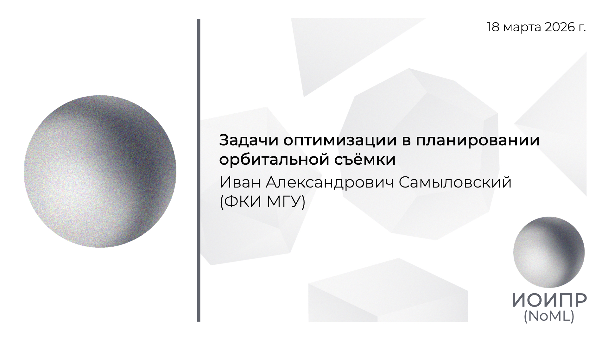

[Сообщество](/README.RU.md) | [Все мероприятия](/Events.RU.md) | [База знаний](/KB/README.RU.md)

**2026-03-18**

# Задачи оптимизации в планировании орбитальной съёмки

**Иван Александрович Самыловский**, к.ф.-м.н, доцент кафедры ММКИ ФКИ МГУ имени М.В. Ломоносова

[YouTube](https://youtu.be/dMB40kfg2mw) \| [Дзен](https://dzen.ru/video/watch/69bd2af6bcbe7d2302a8354c) \| [RuTube](https://rutube.ru/video/52d17b0a2c848b71566f06896a50de60/) \| [Файл](https://disk.yandex.ru/i/vng4XoyghqcxNg) *(~1 час 15 минут)*

## Аннотация доклада

Мы поговорим о математических задачах, которые возникают при необходимости навести аппаратуру спутника на "мишень", будь то локация на планете или центр масс объекта в космосе. Начнём с классики: задачи на минимум при наличии ограничений, включая, разумеется, и задачи терминального управления. А нужно нам это для того, чтобы раскрутить и потом стабилизировать небольшой спутник, чтобы он мог не терять из поля зрения перемещающийся в космосе объект!
