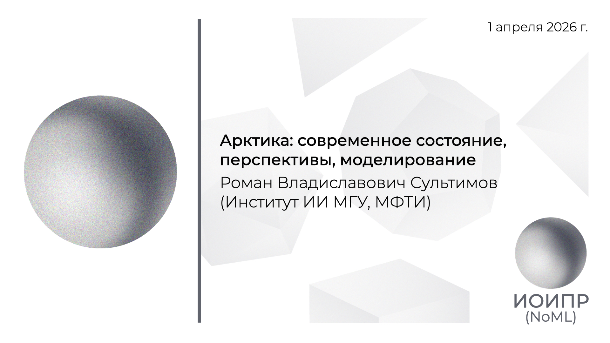

[Сообщество](/README.RU.md) | [Все мероприятия](/Events.RU.md) | [База знаний](/KB/README.RU.md)

**2026-04-01**

# Арктика: современное состояние, перспективы, моделирование

**Роман Владиславович Сультимов**, руководитель научных групп в Институте ИИ МГУ и МФТИ

[YouTube](https://youtu.be/qkU3lwGaXeU) \| [Дзен](https://dzen.ru/video/watch/69e09116598f0f65e3b0efe8) \| [RuTube](https://rutube.ru/video/0fb48b1405d6c1ec10894bbbb54a301d/) \| [Файл](https://disk.yandex.ru/i/FuQn0YazQUX0CA) *(~30 минут)*

## Аннотация доклада

Деградация многолетнемерзлых пород (ММП) в условиях стремительного изменения климата представляет собой критическую угрозу для инфраструктуры и экосистем полярных регионов. Учитывая, что Арктика нагревается значительно быстрее среднеглобальных темпов, традиционные подходы к геокриологическому и климатическому моделированию сталкиваются с фундаментальными ограничениями: чисто физические модели требуют колоссальных вычислительных ресурсов и сложной локальной калибровки, а стандартные методы машинного обучения страдают от недостатка качественных полевых наблюдений (проблема sparse data). В докладе рассматривается смена научно-технологической парадигмы в исследовании Арктики, обусловленная революционным переходом ведущих мировых центров на архитектуры на базе искусственного интеллекта (ИИ) и гибридного моделирования.