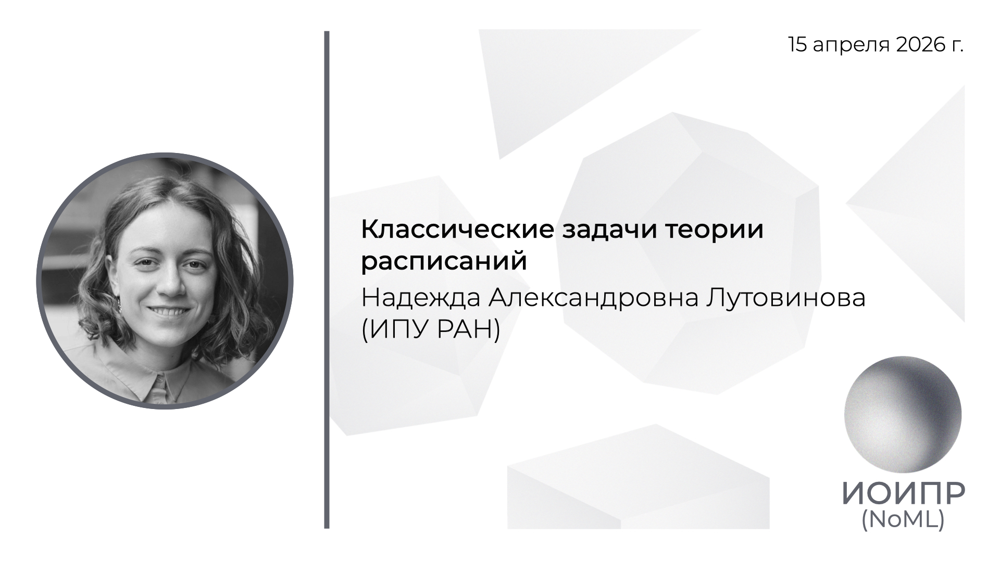

[Сообщество](/README.RU.md) | [Все мероприятия](/Events.RU.md) | [База знаний](/KB/README.RU.md)

**2026-04-15**

# Классические задачи теории расписаний

**Надежда Александровна Лутовинова**, (ИПУ РАН)

[YouTube](https://youtu.be/SoEks3xOWQk) \| [Дзен](https://dzen.ru/video/watch/69e0914e65ea8173c6a339f6) \| [RuTube](https://rutube.ru/video/41377f7ab3b315cead5ce03ced05a4d8/) \| [Файл](https://disk.yandex.ru/i/0OL908P3IyonLg) *(~55 минут)* \| [Презентация](2026-04-15-Lutovinova.pdf)

## Аннотация доклада

Доклад носит обзорный характер и посвящён введению в классическую теорию расписаний — раздел дискретной оптимизации, изучающий задачи распределения работ по приборам с целью минимизации заданного критерия качества. Разбираются основные классы приборов: одиночный прибор, параллельные приборы различных типов, а также специализированные конфигурации — flow shop, job shop и open shop. Среди рассматриваемых ограничений — моменты готовности работ, отношения предшествования, допустимость прерываний и условие выполнения без ожидания между операциями. В качестве целевых функций обсуждаются максимальное время завершения, максимальное запаздывание, суммарные и взвешенные времена завершения, опоздания и количество опоздавших работ. Рассматривается понятие полиномиальной сводимости задач друг к другу, что позволяет выстроить иерархию сложности по типу приборов, ограничениям и критериям оптимальности. Даётся обзор классических алгоритмов и эвристик: правила упорядочивания по ранним срокам, наименьшему времени выполнения, взвешенному времени выполнения, наибольшему времени выполнения и общая схема списочного планирования. 