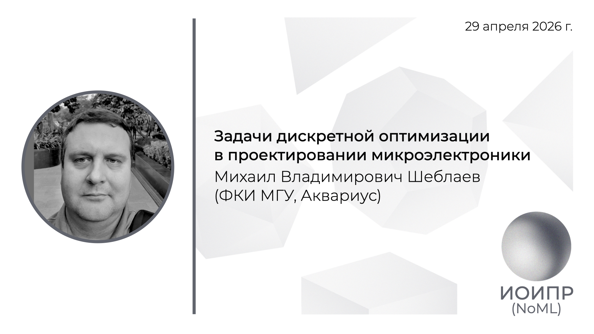

[Сообщество](/README.RU.md) | [Все мероприятия](/Events.RU.md) | [База знаний](/KB/README.RU.md)

**2026-04-29**

# Задачи дискретной оптимизации в проектировании микроэлектроники

**Михаил Владимирович Шеблаев**, к.ф.-м.н, ФКИ МГУ, Аквариус

[YouTube](https://youtu.be/CMBSoPRSIko) \| [Дзен](https://dzen.ru/video/watch/6a043558a62f460406317d89) \| [RuTube](https://rutube.ru/video/af95d8870af32b77c25f9100159319d4/) \| [Файл](https://disk.yandex.ru/i/tIJ-Ba4NlSXRpA) *(~1 час 10 минут)* \| [Презентация](2026-04-29-Sheblaev.pdf)

## Аннотация доклада

В докладе речь пойдет о принципах проектирования и этапах разработки современных сверхбольших интегральных схем, а такж о задачах оптимизации, возникающих на каждом этапе.

## Про VLSI

Материалы от докладчика Михаила Шеблаева.

Во-первых, для всех интересующихся темой: сейчас проходит хакатон Траектория САПР 2026 https://emkonf.ru/marathon, регистрируйтесь и участвуйте!

Во-вторых, хорошая книга с систематическим изложеним задач VLSI: A.B. Kahng, J. Lienig, I.L. Markov, J. Hu, VLSI Physical Design From Graph Partitioning to Timing Closure, 2011

И в-третьих, пара инструментов, которые упоминались на семинаре:
* The OpenROAD Project https://github.com/the-openroad-project
* iEDA https://github.com/OSCC-Project/iEDA

