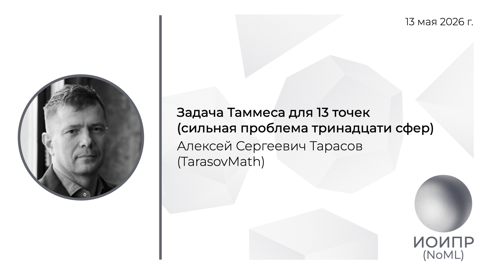

[Сообщество](/README.RU.md) | [Все мероприятия](/Events.RU.md) | [База знаний](/KB/README.RU.md)

**2026-05-13**

# Задача Таммеса для 13 точек (сильная проблема тринадцати сфер)

**Алексей Сергеевич Тарасов**, к.ф.-м.н, TarasovMath

[YouTube](https://youtu.be/M_bIxagAeBw) \| [Дзен](https://dzen.ru/video/watch/6a0fec47e52df929864244a8) \| [RuTube](https://rutube.ru/video/d52ab68cc0b465d051a6d2c85cd472b2/) \| [Файл](https://disk.yandex.ru/i/gPZxv16nBMPmAw) *(~1 час 5 минут)* \| [Презентация](2026-05-13-Tarasov.pdf)

## Аннотация доклада

Как плотно упаковать 13 шаров вокруг единичного шара? Этот вопрос уходит корнями в знаменитый спор Ньютона и Грегори 1694 года: могут ли 13 равных шаров одновременно касаться центрального? Ньютон утверждал, что нет, Грегори — что да. Правота Ньютона была строго доказана лишь в 1953 году (Шютте и ван дер Варден). Но сразу возник следующий, более тонкий вопрос: какого максимального радиуса должны быть 13 шаров, чтобы уместиться вокруг единичного? Это и есть задача Таммеса для N=13, известная также как сильная проблема тринадцати сфер, и она оставалась открытой вплоть до недавнего времени. В докладе будет представлено решение этой задачи. Ключевым инструментом стала нелинейная оптимизация в сочетании с перебором так называемых неприводимых графов — комбинаторных объектов, кодирующих структуру допустимых конфигураций.

