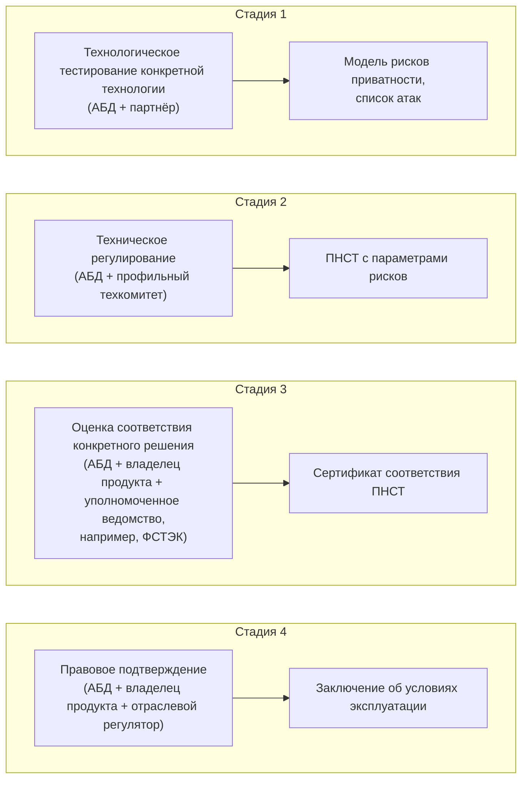

[Сообщество](/README.RU.md) | [Все мероприятия](/Events.RU.md) | [База знаний](/KB/README.RU.md)

**2026-07-15**

# Созвон: Проблемы адаптации технологий конфиденциальных вычислений и PET

[YouTube](https://youtu.be/j2evpz4vG0w) \| [Дзен](https://dzen.ru/video/watch/6a618da07033a635243f8d7d) \| [RuTube](https://rutube.ru/video/5e8ba169a4d6b5250a6bc480baebbc77/) \| [Файл](https://disk.yandex.ru/i/RUq2BoAs8bmsdA) *(~1 час 50 минут)* \| [Презентация](2026-07-15-CALL-PET.pdf)

## Содержание

* [Аннотация](#аннотация-доклада)
* [Саммари встречи (Денис Афанасьев)](#саммари-встречи-денис-афанасьев)
* [Еще саммари и мысли (Павел Снурницын)](#мысли-по-мотивам-созвона-павел-снурницын)

## Аннотация доклада

Технологии конфиденциальных вычислений (и в более широком смысле PET, Privacy-Enhancing Technologies) и потенциальные бизнес-кейсы их применения в контексте задач данных и аналитики мы обсуждаем уже давно.

В этот раз решили поговорить подробнее о вызовах на пути их массового внедрения. Ключевые барьеры сейчас лежат не в технологической, а в организационной и методологической плоскости.

Коллеги из Ассоциации больших данных поделятся своим видением проблем и подходами к их решению:
* Как считать риски при использовании PET?
* Кто берёт эти риски на себя: бизнес, регулятор, оператор данных, вендор технологии?
* Как выглядит пайплайн митигации рисков и что нужно, чтобы ввести его в правовое поле?

Далее проведём широкое обсуждение указанных и смежных вопросов с участием других экспертов данной области.

---

## Саммари встречи (Денис Афанасьев)

### Основной доклад. Математическая оценка рисков приватности (АБД)

#### Постановка проблемы

Регуляторика требует провести «оценку достаточности» методов обезличивания, но не определяет, что такое достаточность. Формально проверить невозможность восстановления персональных данных нельзя: формулировка «при бесконечном времени и бесконечных ресурсах» не проверяема. Отсюда ключевой сдвиг: защищенность данных — не бинарное «защитили / не защитили», а вероятностная величина, которой нужно управлять.

Отличие от классической ИБ: триада конфиденциальность-целостность-доступность защищает контур, в котором лежат данные. Риск приватности — про природу самих данных, которые из контура передаются наружу.

#### Формула риска

Риск приватности = математическое ожидание ущерба:

$$R=\sum_i P(\text{событие } i | \text{данные, контекст, метод, модель нарушителя}) \times \text{Ущерб }i$$

- Вероятность события (утечка, разглашение, восстановление ПДн) зависит от самих данных, контекста обработки, применяемого метода PET и модели нарушителя.
- Ущерб складывается из трех составляющих: компенсации субъектам ПДн (монетизируются через суд), штрафы, репутационные потери. Розничные компании боятся репутационных потерь (снижение LTV, ухудшение воронки) больше, чем штрафов.

#### Кто управляет риском приватности

Не CISO: его инструменты и атаки защищают контур, а не содержимое. Роль лежит между CDO и DPO. В логике GDPR это движется в сторону классического risk assessment (DPIA, журнал ROPA) и операционных рисков под управлением DPO. В России функция чаще растет из ИБ, legal или комплаенса, то есть остается юридической, а не расчетной. Единой компетенции для расчета таких рисков нет: по FL она ближе к кибербезопасности, по обезличиванию и синтезу — к Data Science. Открытый вопрос: кто управляет комплексом рисков, опираясь на тех, кто умеет их считать.

#### Риск-модели по технологиям

**Обезличивание.** Самый доступный и наименее защищенный метод. Применим, когда на выходе нужна «правда»: отчетность, статистика, открытые данные. Аддитивная модель на трех классических атаках (модель Джоми): выделение записи (k-анонимность), связывание (Феллеги-Сантер плюс собственный метод CVPL, опубликован на arXiv, по тестам точнее классики), выделение атрибута (условная энтропия). Веса атак настраиваются под сценарий использования.

**Синтетические данные.** Вышел предварительный национальный стандарт (ПНСТ) по синтезу данных, вступает в силу с 1 сентября. Метрики: DCR/NNDR (расстояние до ближайших соседей — синтетика не ближе к обучающим данным, чем тестовая выборка), membership и attribute inference через shadow-модели, риск выделения паттернов малых групп и выбросов через корреляцию векторов feature importance. Важный вывод: без differential privacy математических гарантий приватности при синтезе нет, и DP закрывает только риск выделения.

**Вертикальное федеративное обучение.** Совместно с партнером (Guardora) построена сценарная модель: около 30 атак на градиенты, механизм агрегации, обновления модели, инференс, плюс организационные риски (governance) и сговор участников. Риск = сумма по сценариям: априорная вероятность × тяжесть × покрытие мерами снижения. В базовом варианте атака на градиенты практически гарантированно раскрывает данные поставщика; примерно половина сценариев закрывается гомоморфным шифрованием. Отдельная зона рисков — PSI, необходимый перед вертикальным FL; по нему готовится отдельная модель.

**Конфиденциальные вычисления (MPC и др.).** Работа только началась, предварительная модель — сценарная.

#### Выводы доклада

- Универсального решения нет. Риск зависит от данных, сценария обработки и метода.
- Как только риск измерен — им можно управлять: принимать, снижать, обосновывать перед регулятором.
- Объект оценки — не технология, а сценарий обработки. Большая часть риска живет вокруг технологии, а не внутри нее.
- Риск-модель — инструмент принятия решений, в том числе управленческих.

#### План Ассоциации

Конвейер: тестирование на бизнес-кейсах партнеров → риск-модель технологии → ПНСТ через Росстандарт → оценка соответствия и сертификация → регуляторные условия эксплуатации (fast track).

Цель: организация принимает риск, валидированный регулятором, и защищается как минимум от штрафной части ущерба. Юридический контекст: судебная практика уже учитывает принятые оператором меры, снижая или отменяя штрафы за утечки. Минцифры и Роскомнадзор вовлечены в работу техкомитетов. Открытый вопрос: кто станет сертифицирующим органом — ФСТЭК про другое, других кандидатов пока нет. Ожидается несколько итераций: добровольная сертификация → рыночная → государственная.

### Секция обсуждения

#### Где живут кейсы

Рабочие кейсы концентрируются в холдингах: единый владелец риска на уровне группы, данные не покидают общий контур, ущерб субъектам минимален. Классика: банк + телеком (кейсы с ~2016 года), зарубежный пример — азиатский холдинг с авиакомпанией, банком и телекомом.

Большинство кейсов лежит на пересечении четырех режимов тайн: тайна связи, банковская тайна, персональные данные (152-ФЗ, наименее проблемная — решается согласиями), фискальная/налоговая тайна, плюс институт бюро кредитных историй как доверенной стороны. Системная проблема: регулятор регулирует кейсы, а не данные как объект, и это общемировая ситуация.

Между независимыми компаниями единственный инструмент контроля — договор. Вопрос ИБ «как вы будете контролировать ту сторону» останавливает большинство проектов. При расширении схемы до «звезды» со многими недоверенными участниками вероятность инцидента и ущерб растут скачком.

#### Экономика технологии

Самая жесткая критика: конфиденциальные вычисления сравнили с трофейным огнеметом — мощно, дорого, непонятно зачем дома. Внутри холдинга достаточно VPN, между компаниями — договоров: скоринги от четырех операторов покупаются по прогнозируемому прайсу, который можно принести CFO. Аналогия с сетью авиадиспетчеров: никто не хочет инвестировать первым.

Контраргументы: обмен «на флешке» — это не управление риском, а его отрицание, и работает только пока импакт мал. Кейсы между конкурентами (пересечение аудиторий, общие рекламные лиды) требуют схем сложнее несоленого хеширования — здесь потенциально большие деньги, а решение со временем может стать коробочным и дешевым. Ключевой критерий ценности: не разовые сверки, а высокочастотные, повторяющиеся в рантайме операции.

Общая рамка: перед стройкой должен идти «паровозик» с вопросом, есть ли вообще экономический эффект от объединения данных и нельзя ли получить его дешевле при упрощенной регуляции. Суровая правда: конфиденциальных вычислений будут избегать настолько, насколько это возможно.

#### Парадокс LLM

Организации, у которых кейсы FL годами не взлетали из-за рисков, сегодня отдают документы и данные в ChatGPT и Claude по договору уровня «честное слово». Причина: выгода от производительности LLM настолько велика, что покрывает все риски. Вывод дискуссии: проблема адаптации PET не в технологии, а в соотношении выгоды и стоимости риска.

#### Ценность данных и разделение выгоды

Опыт распределения прибыли между участниками совместной модели через веса признаков (feature importance) в итоговой модели. Контринтуитивный результат: наибольшую ценность вносят маленькие, но уникальные датасеты со специфическими зависимостями и корреляциями. Миллиард транзакций крупного банка не дает больше предсказательной силы, чем миллион из того же распределения. Больше данных не значит больше ценности.

Отдельный тренд: последние 20 лет ценностью считались поведенческие данные и факты, за последний год ценностью становится разметка — для генеративных моделей ее банально не хватает. Для конфиденциальных вычислений это вычислительно более простой кейс (минимальный набор признаков вместо таблиц фактов), что может добавить технологии спроса.

Рыночная асимметрия: все крупные игроки готовы покупать данные, но никто не хочет выставлять свои. FL интересен именно тем, что получить внешнюю ценность нельзя, не внеся свою; дизайн механизмов взаимодействия участников уже исследуется на стыке с теорией игр.

#### Частота обновления моделей и новые риски

ML-модели деградируют, и PET позволяют частотно обновлять модели на закрытой разметке: кредитный скоринг, антифрод, компьютерное зрение. Обратная сторона: периодичность создает новые точки утечки (атака на новые данные — одна из 30 в модели вертикального FL) и открывает проблему отравленных данных. В FL отравленные данные — это отравленные градиенты, классическая фильтрация по распределению для них не работает. Смягчающий фактор: около 90% значимых признаков модели обычно внутренние, внешние данные добавляют порядка 15% качества, что ограничивает и пользу, и масштаб отравления.

#### Универсальная платформа

Универсальная платформа конфиденциальных вычислений «для всех задач» признана нереализуемой даже на уровне государства: модель угроз зависит от бизнес-кейса и, глубже, от профиля конкретных данных — даже у простого PSI множество протоколов с разными рисками на разных данных.

Реалистичный формат: платформа + методология + библиотека проработанных сценариев и стандартизированных механизмов. Даже перечень типовых успешных сценариев ускорил бы внедрение — у ИБ появился бы ответ на вопрос «где систематизированные решения». Идея госсубсидирования большой федеративной платформы упирается в риск централизации: все потоки через ЦБ и Минцифры — сомнительный дизайн.

### Итог

Технологический стек PET готов сильнее, чем экономика и организационный слой вокруг него. Пока риск можно принять или закрыть договором — его принимают и закрывают договором. Ниша технологии там, где выгода очевидна и велика (LLM-парадокс это доказывает), где операции высокочастотны и где централизация данных невозможна в принципе. Работа АБД — риск-модели, стандарты, сертификация — строит недостающий слой между технологией и регулятором.

---

## Мысли по мотивам созвона (Павел Снурницын)

### Методика оценки рисков от Ассоциации Больших Данных

Риск приватности формализуется как математическое ожидание ущерба: это сумма по всем возможным событиям их вероятности наступления (которая зависит от данных, метода/механизма, контекста использования и модели нарушителя) умноженной на оценку величины ущерба от этого события:

$$R = \mathbb{E}[L] = \sum_{i} P(E_i \mid D, M, C, A) \cdot L(E_i)$$

где $D$ — данные, $M$ — метод/механизм обработки, $C$ — контекст использования, $A$ — модель нарушителя, $E_i$ — событие-нарушение (например, утечка), $L(E_i)$ — ущерб от этого события.

Далее есть несколько способов декомпозиции — от простой аддитивной модели (риск как взвешенная сумма отдельных атак) и сценарной модели (сумма по вариантам развития событий) до причинно-следственной модели (что именно ведёт к утечке) и байесовской сети (для случаев, когда риски по разным атакам не независимы друг от друга, а коррелируют).

Полезно держать в голове и более простую рамку, стоящую за всеми этими формулами: обработка данных, которая усиливает защиту (обезличивание, шум, агрегация), почти всегда одновременно снижает их полезность — это две монотонные функции, движущиеся в противоположные стороны. Задача риск-модели — не «доказать безопасность», а найти в этом компромиссе рабочую точку: где защита уже достаточна, а полезность ещё не убита.

Под каждую технологию — проработана (или прорабатывается) своя версия этой модели:
- *Обезличивание* — аддитивная модель из трёх вероятностей: выделение записи (k-anonymity), связывание с внешними данными (метод Филлеги-Сунтера или CVPL) и вывод атрибута (через условную энтропию).
- *Синтез данных* — вектор из шести рисков (запоминание, связывание, вывод атрибута, membership inference, риск для малых групп, риск доступа), тоже сведённый в аддитивную модель; здесь уже вышел [предварительный национальный стандарт (ПНСТ)](https://lib.rubda.ru/best/seriya-pnst-sintez-dannyh.html).
- *Федеративное обучение* — тут модель принципиально другая, сценарная: для вертикального FL уже известно порядка 30 сценариев атак (на градиенты, агрегацию, инференс, сговор участников, ...), каждый взвешен по вероятности, тяжести последствий и степени покрытия мерами защиты.
- *Криптографические методы (SMPC/PSI/FHE)* — тоже сценарная модель, но работа только начата, вектор рисков (вход, протокол, метаданные, выход, коллизии) есть, методика пока в проработке.

Методика Fast Track — это четырёхстадийный конвейер:

Важная особенность конвейера — он не статичен. Если после сертификации выясняется, что метод недооценивал риск (например, найдена новая атака или уточнена модель нарушителя), пороги риска в соответствующем ПНСТ пересматриваются — и все, кто уже сертифицировался по старой версии, обязаны пройти сертификацию заново под новый порог. То есть Fast Track — это не «сертифицировал один раз и забыл», а живой контур с обратной связью, и бизнесу, выбирающему технологию, стоит закладывать это как операционный риск.

То есть смысл Fast Track — не в том, что риск обнуляется, а в том, что появляется предсказуемый путь «протестировали — застандартизировали — сертифицировали — получили регуляторное одобрение», вместо ситуации, когда каждый кейс нужно с нуля защищать перед регулятором.

### Кто берёт на себя риск: регулятор и DPO

Мировая практика здесь примерно такая: в логике GDPR за приватность отвечает офис DPO (Data Protection Officer), у которого есть свои инструменты — Data Protection Impact Assessment для оценки риска конкретных процессов обработки и журнал ROPA (Record of Processing Activities) для реестра всех обработок. Изначально DPO часто воспринимался скорее как юридическая/комплаенс-роль («прошёл аудит — считаешься GDPR-compliant»), но постепенно эта функция дрейфует в сторону полноценного риск-менеджмента, похожего на операционные риски в банках — то есть DPO не просто проверяет бумажки, а управляет вероятностной моделью риска. В России эта роль пока распространена слабо и чаще прорастает либо из ИБ, либо из юридической/риск-функции, но направление, судя по всему, то же самое.

### Реестр успешных бизнес кейсов

Снова всплыл старый больной вопрос: по сути, нет обширного списка конкретных бизнес-кейсов с внятным финансовым эффектом и более аргументированным обоснованием чем «без конфиденциальных вычислений тут не обойтись», все говорят слишком абстрактно. Участник обсуждения Ринат предложил собрать кейсбук с реальными примерами, где это взлетело и принесло деньги. Идея кажется правильной и давно назревшей: пока индустрия оперирует общими словами про «огромный потенциал», у бизнеса просто нет аргументов, на которые можно сослаться при обосновании решения.

### Как оценивать эффект и делить затраты

Ринат также поднял другой больной вопрос: как оценивать эффект от объединения данных, как делить косты между участниками и как понять, чьи данные ценнее. Тут прозвучал хороший пример: в одном из прошлых пилотов выяснилось, что решающий вклад в качество совместной модели вносят не большие объёмы данных крупного банка (они просто дублируют уже известную статистику), а маленький, но уникальный сегмент — данные, которых больше ни у кого нет. То есть «больше данных» ≠ «больше пользы», и это прямо противоречит интуиции участников с крупными портфелями, которые ожидают, что раз у них данных больше — то и доля в эффекте должна быть больше.

Из этого следует, каким должен быть кейсбук, чтобы закрыть проблему, а не повторить абстрактные разговоры про потенциал: каждый кейс в нём должен содержать не только описание бизнес-задачи, но и
- посчитанный финансовый эффект от объединения данных с методикой расчёта;
- явное обоснование, почему этого эффекта нельзя было достичь более простыми средствами — договором, обменом агрегатами, покупкой готового скоринга, — и почему потребовались именно PET; 
- обоснование выбора конкретной технологии (FL, MPC, синтез и т.д.) под конкретный профиль данных и модель угроз, а не технологию «вообще».

Без этих трёх компонентов кейсбук снова превратится в набор историй «мы попробовали и было интересно», которые не убеждают ни бизнес, ни безопасников, ни регулятора.

### Разметка как ценность

Отдельно также стоит подсветить наблюдение другого участника Романа: последние лет 20 рынок жил в парадигме, что ценность — это поведенческие данные и факты, а разметка — расходный материал. За последнее время ситуация развернулась: вычислительных мощностей и сырых данных стало относительно много, а качественной разметки не хватает катастрофически. Разметка сама становится ценным активом — а значит, вопрос «как поделиться разметкой, не раскрывая исходные данные» и какие модели угроз здесь применимы, это новая грань для PET, которую индустрия, кажется, ещё толком не осмыслила.

## Платформа конфиденциальных вычислений

Также снова поднялся вопрос про некоторую «универсальную платформу» для конфиденциальных вычислений, то есть закрывающую все технологии для всех потенциальных бизнес кейсов. Консенсус участников дискуссии в том, что подобную платформу как IT платформу в общепринятом смысле построить практически невозможно — это бесконечный бюджет и бесконечное строительство. Участник дискуссии Сергей верно добавил ещё один слой сложности: риск зависит не только от сценария, но и от конкретного профиля данных участников — то есть даже с готовыми механизмами задача пересчёта риска под новый набор участников не становится тривиальной. К этому добавляется ещё и экономическая асимметрия рынка: крупные компании охотно покупали бы чужие данные, но почти никто не готов выставлять на рынок свои — обмен воспринимается как односторонняя потеря конкурентного преимущества. Отсюда и привлекательность FL как формата: каждый участник вносит вклад в общую модель, не передавая сами данные наружу. Это уже пересекается с теорией игр — как спроектировать механизм взаимодействия участников так, чтобы выгода распределялась соразмерно вкладу, а не терялась в переговорах о том, кто первый готов поделиться.

Таким образом, более реалистичный ориентир — это не платформа в айтишном смысле «нажал кнопку — заработало», а связка из технологических фреймворков, методологий оценки модели угроз и модели безопасности, методологий оценки данных и эффектов, и — самое важное — верхнеуровневой методологии, которая проводит конкретную задачу через путь наименьшего сопротивления: «Можно ли решить вопрос на уровне договора, не поднимая тяжёлую артиллерию PET?» «Если нужны PET — какие именно, для какого этапа (разработка модели или прод)?» «Есть ли уже типовой сценарий под эту задачу или его придётся собирать с нуля?» 

Собственно, в этом наверное и есть главный практический вывод дискуссии: индустрии не хватает не столько новых технологий, сколько согласованной методологии оценки риска и эффекта, к которой можно апеллировать в диалоге с безопасниками, DPO и регулятором.