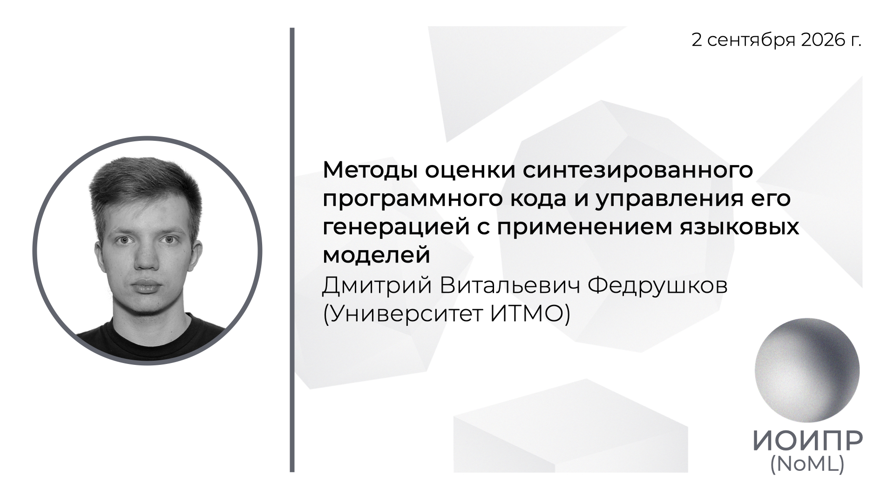

[Сообщество](/README.RU.md) | [Все мероприятия](/Events.RU.md) | [База знаний](/KB/README.RU.md)

**2026-09-02**

# Методы оценки синтезированного программного кода и управления его генерацией с применением языковых моделей

**Дмитрий Витальевич Федрушков**, аспирант, Университет ИТМО

[YouTube](https://youtu.be/cfgilQOWWoc) \| [Дзен](https://dzen.ru/video/watch/6a9941dcb9766f4fc7f73d6d) \| [RuTube](https://rutube.ru/video/e90e6ce7dead69e7e0c74f58d7556ea0/) \| [Файл](https://disk.yandex.ru/i/TqVdvXL3JGeMgg) *(~1 час 50 минут)* \| [Презентация](2026-09-20-Fedrushkov.pdf)

## Аннотация доклада

При генерации программного кода с помощью больших языковых моделей зачастую отсутствует эталонное решение, с которым можно было бы сравнить полученный результат, а существующий набор тестов может быть неполным или вовсе отсутствовать. Поэтому для практического использования таких систем необходимы методы оценки качества, способные работать непосредственно с сгенерированным кодом, не опираясь на референс и выполнение тестов. В докладе будет рассмотрен подход к многокритериальному безреференсному оцениванию, объединяющий формально проверяемые свойства кода с вероятностными и семантическими оценками языковых моделей. Будет показано, как различные оценочные сигналы дополняют друг друга и позволяют получить более устойчивую и интерпретируемую оценку качества. Отдельно будет рассмотрено использование такой оценки в качестве обратной связи для управления генерацией.