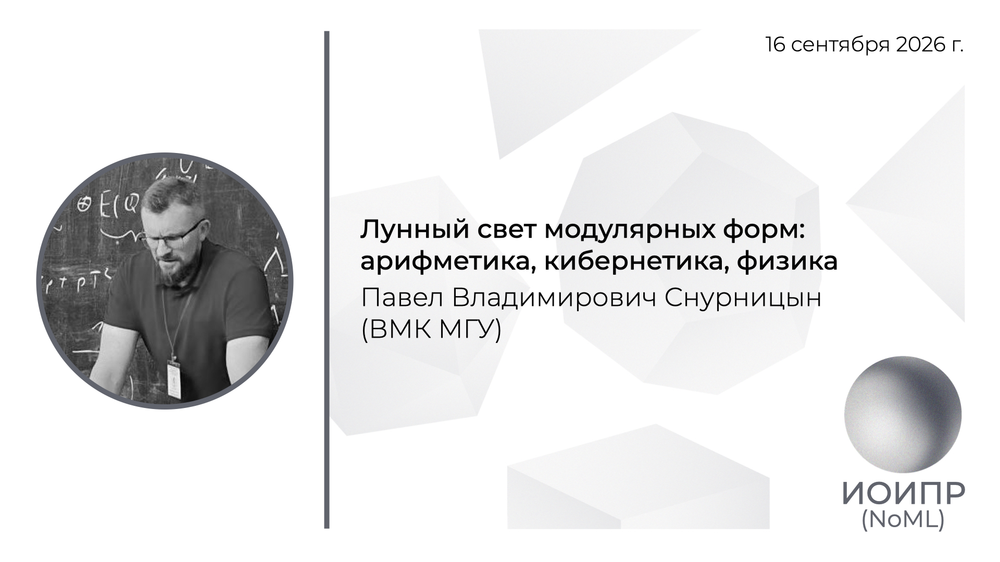

[Сообщество](/README.RU.md) | [Все мероприятия](/Events.RU.md) | [База знаний](/KB/README.RU.md)

**2026-09-16**

# Лунный свет модулярных форм: арифметика, кибернетика, физика

**Павел Владимирович Снурницын**, к.ф.-м.н, старший научный сотрудник кафедры ИБ ВМК МГУ имени М.В. Ломоносова

[YouTube](https://youtu.be/2JJRCisqvqg) \| [Дзен](https://dzen.ru/video/watch/6aae0d54c4970221d9f1e79b) \| [RuTube](https://rutube.ru/video/9470ff8248b00e9380db6f69c16ace7b/) \| [Файл](https://disk.yandex.ru/i/LgID4FOEiyNqoQ) *(~2 часа)* \| [Презентация](2026-09-16-Snurnitsyn.pdf)

## Аннотация доклада

Мартину Эйхлеру приписывают следующие слова: «Существует пять фундаментальных операций в математике: сложение, вычитание, умножение, деление и модулярные формы». Действительно, модулярные формы изначально возникли в контексте решения задач теории чисел, но постепенно стали одним из центральных объектов современной математики. Именно они стоят за доказательством великой теоремы Ферма, объясняют рекорды упаковки шаров в высоких измерениях, проникают в конструкции постквантовых криптографических схем, а также имеют фундаментальную связь с теорией струн в физике. При этом модулярные формы редко появляются даже в университетских курсах, а над ними незаслуженно витает ореол сложности и высокого порога входа. В докладе попытаемся развеять этот миф, познакомимся с модулярными формами через конкретные примеры и увидим, как один и тот же объект связывает задачи, которые принято считать далёкими друг от друга. В конце концов, границы между дисциплинами - это артефакт учебных программ, а не устройства математики и мира.