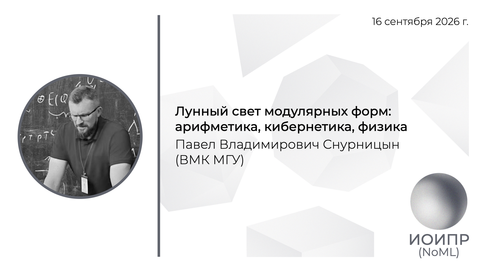

[Сообщество](/README.RU.md) | [Все мероприятия](/Events.RU.md) | [База знаний](/KB/README.RU.md)

**2026-09-16**

# Лунный свет модулярных форм: арифметика, кибернетика, физика

**Павел Владимирович Снурницын**, к.ф.-м.н, старший научный сотрудник кафедры ИБ ВМК МГУ имени М.В. Ломоносова

[YouTube](https://youtu.be/2JJRCisqvqg) \| [Дзен](https://dzen.ru/video/watch/6aae0d54c4970221d9f1e79b) \| [RuTube](https://rutube.ru/video/9470ff8248b00e9380db6f69c16ace7b/) \| [Файл](https://disk.yandex.ru/i/LgID4FOEiyNqoQ) *(~2 часа)* \| [Презентация](2026-09-16-Snurnitsyn.pdf)

## Аннотация доклада

Мартину Эйхлеру приписывают следующие слова: «Существует пять фундаментальных операций в математике: сложение, вычитание, умножение, деление и модулярные формы». Действительно, модулярные формы изначально возникли в контексте решения задач теории чисел, но постепенно стали одним из центральных объектов современной математики. Именно они стоят за доказательством великой теоремы Ферма, объясняют рекорды упаковки шаров в высоких измерениях, проникают в конструкции постквантовых криптографических схем, а также имеют фундаментальную связь с теорией струн в физике. При этом модулярные формы редко появляются даже в университетских курсах, а над ними незаслуженно витает ореол сложности и высокого порога входа. В докладе попытаемся развеять этот миф, познакомимся с модулярными формами через конкретные примеры и увидим, как один и тот же объект связывает задачи, которые принято считать далёкими друг от друга. В конце концов, границы между дисциплинами - это артефакт учебных программ, а не устройства математики и мира.

## Литература

**Начинающий**
- Первые главы в [W. Stein, Modular Forms: A Computational Approach.](https://wstein.org/books/modform/stein-modform.pdf) 2007 — Мягкий вход в теорию модулярных форм, сложные доказательства часто опущены, много примеров вычислений в SageMath, т.е. можно сразу "покрутить руками".
- Глава II в W. Ebeling, Lattices and Codes. 2013 — Введение ориентированное на приложения к решеткам, тета-функциям и кодам, следует изложению как в книге Серра, можно использовать и как первое чтение, и как дополнение к Серру. В первой главе краткое и хорошее введение в коды на решетках.

**Продолжающий**
- Глава VII в Ж.-П. Серр, Курс арифметики. 1972 (J.-P. Serre, Cours D’Arithmetique. 1970) — Классическое введение в модулярные формы, можно сразу открывать главу VII, она в целом самодостаточная, однако при первом знакомстве с темой текст может показаться достаточно плотным.
- Главы III-IV в Н. Коблиц, Введение в эллиптические кривые и модулярные формы. 1988 (N. Koblitz, Introduction to Elliptic Curves and Modular Forms. 1993) — Модулярные формы неразрывно связаны с эллиптическими кривыми (кстати по ЭК уже с большой вероятностью должен случиться наш спецкурс будущей весной). В главе III введение в модулярные формы для полной модулярной группы, а в главе IV раскрываются темы модулярных форм для конгруэнц-подгрупп и МФ полуцелых весов.
- Первый раздел в J.H. Bruinier, G. van der Geer, D. Zagier, The 1-2-3 of Modular Forms. 2008 — Здесь более широкий контекст МФ и их математических приложений, а в последующих разделах раскрыты другие объекты и конструкции мира модулярных форм (МФ Гильберта, МФ Зигеля, МФ Якоби, …)
- П. Сарнак, Модулярные формы и их приложения. 1998 (P. Sarnak, Some Applications of Modular Forms. 1990) — Модулярные формы имеют много приложений в самых разных областях, несколько красивых примеров приложений раскрыты в этой небольшой книжке.

**Продвинутый**
- Дж. Конвей, Н. Слоэн, Упаковки шаров, решётки и группы. 1990 (J.H. Conway, N.J.A. Sloane, Sphere Packings, Lattices and Groups. 1999) — Книга в целом пропитана объектами из мира модулярных форм, но это точно не текст для первого чтения.
- T. Gannon, Moonshine Beyond the Monster. 2007 — А эта книга в сторону физики, для тех, кто либо уже продвинулся в целом в математике (не только в части МФ), либо готов воспринимать многие вещи на веру, как данность.

Полный список литературы по теме иожно найти на странице спецкурса ВМК [Aрифметика II Решетки и формы](https://github.com/pvsnurnitsyn/Arithmetique/blob/main/A-II/README.md).