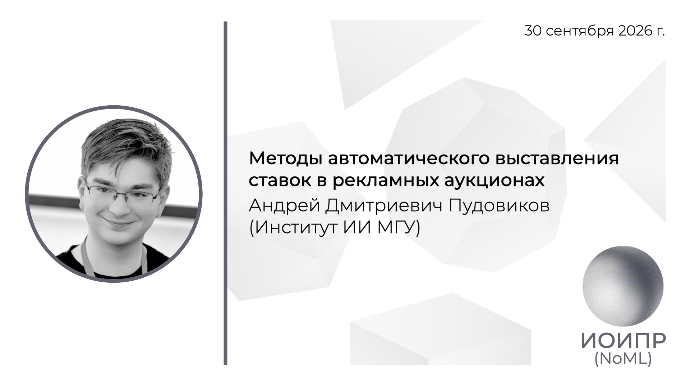

[Сообщество](/README.RU.md) | [Все мероприятия](/Events.RU.md) | [База знаний](/KB/README.RU.md)

**2026-09-30**

# Методы автоматического выставления ставок в рекламных аукционах

**Андрей Дмитриевич Пудовиков** (Институт ИИ МГУ)

[YouTube](https://youtu.be/-PCnxVXzjCU) \| [Дзен](https://dzen.ru/video/watch/6abe2babbeb3f946073bc7f1) \| [RuTube](https://rutube.ru/video/224489ad748ab69efdadabf575f0b8b1/) \| [Файл]() *(~1 час)* \| [Презентация](2026-09-30-Pudovikov.pdf)

## Аннотация доклада

В докладе рассмотрим, как автоматически выбирать ставки в рекламных аукционах, чтобы максимизировать число конверсий при ограничениях на бюджет и стоимость клика. Разберём математическую постановку задачи и основные подходы к её решению — от оптимизации и методов теории управления до обучения с подкреплением. Отдельно обсудим, как учитывать ошибки прогнозов вероятностей клика и конверсии и оценивать качество алгоритмов на практике.