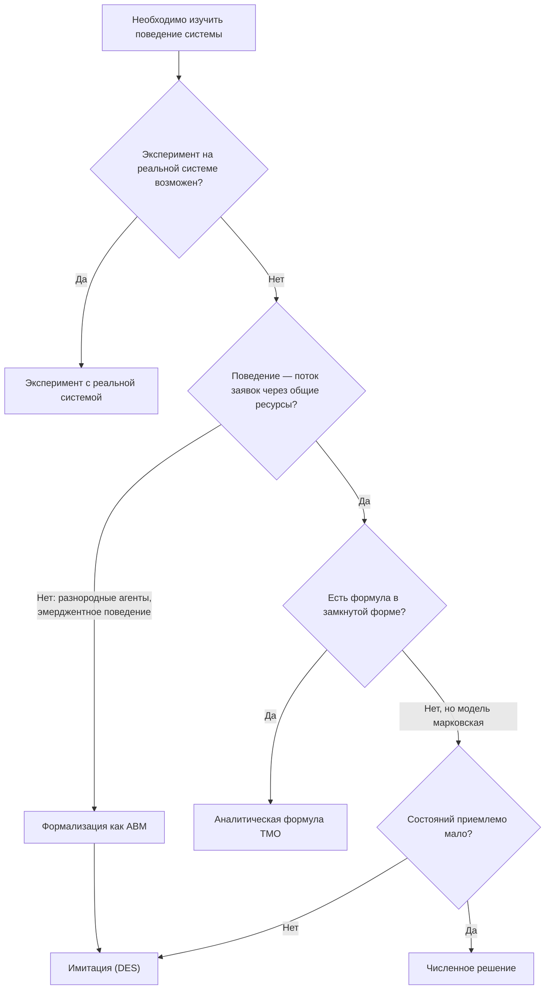
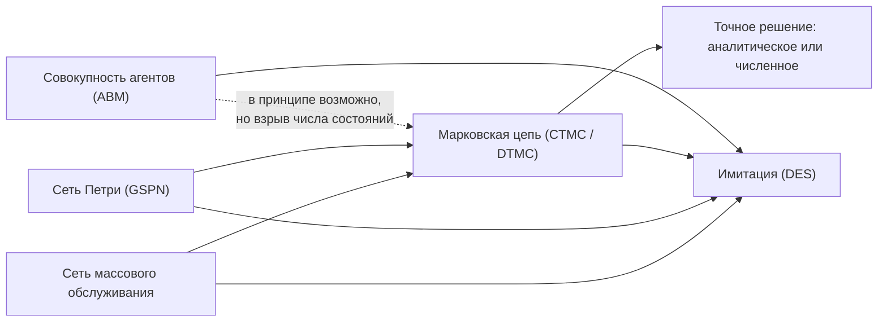

# Имитационное моделирование и теория массового обслуживания

* [Простыми словами и на примерах](#простыми-словами-и-на-примерах)
* [Семинары ИОИПР по теме](#семинары-иоипр)
* [Подробнее: методы, границы, практика](#подробнее-методы-границы-практика)
* [Материалы](#материалы)
* [Ландшафт решений](#ландшафт-решений)

## Простыми словами и на примерах

### Что такое ИМ и ТМО

Подходы позволяют создать «цифровой двойник» любого процесса — виртуальную среду, в которой можно безопасно проверять решения до их реального внедрения. Теория массового обслуживания (ТМО, или теория очередей - Queueing Theory) даёт аналитические формулы для частных случаев: что происходит с системой, в которой есть несколько связанных очередей (длины очередей, времена ожидания, количество клиентов/агентов в системе, ...), если увеличить входной поток или добавить новый узел. Если аналитический ответ получить нельзя, на помощь приходит (дискретно-событийное) имитационное моделирование (DES, Discrete-Event Simulation ), в котором виртуальная копия процесса проигрывается в ускоренном времени. Вместе эти инструменты отвечают на вопрос: «Что произойдёт, если мы изменим систему таким-то образом?» — без риска и без необходимости проводить дорогостоящий реальный эксперимент.

### Примеры и кейсы

**Проектирование сервисного центра.** Банк открывает новое отделение. Сколько окон обслуживания нужно, чтобы 95% клиентов ждали не дольше пяти минут? Имитационная модель воспроизводит поток клиентов с учётом часовой неравномерности, разных типов запросов и времени обслуживания — и позволяет ответить на этот вопрос до первого дня работы отделения.

**Управление больничным потоком.** Больница хочет сократить среднее время нахождения пациента в приёмном отделении. Имитационная модель воспроизводит путь пациента через триаж, диагностику, консультации и решение о госпитализации, выявляет «узкие места» — и позволяет сравнить варианты перераспределения персонала и изменения протоколов без риска для пациентов.

**Проектирование и оптимизация складского комплекса.** Логистический оператор проектирует новый распределительный центр и стоит перед рядом взаимосвязанных решений: сколько зон приёмки и отгрузки, какова оптимальная глубина стеллажного хранения, сколько единиц подъёмно-транспортного оборудования нужно при пиковой нагрузке. Аналитические формулы дают ответ лишь для упрощённых случаев — реальный склад сочетает несколько типов потоков, приоритеты заказов, временные окна поставщиков и переменную интенсивность отгрузок в течение суток. Дискретно-событийная имитационная модель воспроизводит работу склада в ускоренном времени: каждый паллет, каждая единица техники, каждая очередь у ворот. Прогоняя сотни сценариев с разными конфигурациями, модель показывает, при каком сочетании параметров пропускная способность достигает целевого уровня, а простои техники и персонала минимальны — до того, как принято решение о строительстве.

**Имитация пассажиропотока в аэропорту.** Аэропорт планирует реконструкцию терминала и хочет понять, как изменится время прохождения пассажиров через контроль безопасности и посадочные зоны при разных конфигурациях. Сетевая имитационная модель описывает терминал как граф узлов (стойки регистрации, зоны досмотра, выходы на посадку) и потоков между ними. Прогоняя тысячи сценариев с разными интенсивностями рейсов и конфигурациями персонала, модель показывает, где возникают очереди при пиковой нагрузке и какая перепланировка даёт наибольший выигрыш — до начала строительства.

## Семинары ИОИПР

* [Виталий Черненко (Амальгама), Имитационное моделирование: планирование и поддержка принятия решений на реальных примерах](/2025/2025-04-16-Chernenko-SM/README.md). [YouTube](https://youtube.com/live/LVBEX5l97RA) \| [Дзен](https://dzen.ru/video/watch/6803b248c712ee314d9b1321) \| [RuTube](https://rutube.ru/video/59e262174726de82ecc3827416202d79/) *(~1 час 50 минут)*

## Подробнее: методы, границы, практика

### Глоссарий и сокращения

| Сокращение | Расшифровка (RU) | Расшифровка (EN) | Что это |
|---|---|---|---|
| ИМ | Имитационное моделирование | Simulation Modeling | Упрощённая исполняемая модель системы, проигрываемая во времени |
| ТМО | Теория массового обслуживания | Queueing Theory | Аналитический и численный аппарат для расчёта длин очередей, времени ожидания и пропускной способности |
| СМО | Система массового обслуживания | Queueing System | Конкретная система с очередью и обслуживающими приборами — объект изучения ТМО |
| DES | Дискретно-событийное (имитационное) моделирование | Discrete-Event Simulation | Имитация, в которой состояние системы меняется только в моменты дискретных событий |
| ABM | Агент-ориентированное моделирование | Agent-Based Modeling | Имитация через поведение автономных агентов; системный эффект возникает как эмерджентный результат |
| MAO | Мультиагентная оптимизация | Multi-Agent Optimization | Архитектурный паттерн децентрализованного принятия решений несколькими оптимизирующими агентами |
| CTMC / DTMC | Марковская цепь с непрерывным / дискретным временем | Continuous-/Discrete-Time Markov Chain | Формализм описания состояний системы и переходов между ними |
| GSPN | Обобщённая стохастическая сеть Петри | Generalized Stochastic Petri Net | Формализм для систем со сложной синхронизацией и параллелизмом; транслируется в марковскую цепь |
| M/M/1, M/M/c | — | — | Стандартная запись типа СМО: распределение прибытий / распределение обслуживания / число приборов |

### Агент-ориентированное моделирование (ABM)

Дискретно-событийное моделирование описывает систему как последовательность событий; теория очередей — как потоки через узлы. Но некоторые системы лучше описываются как совокупность автономных агентов — людей, компаний, транспортных средств — каждый из которых следует собственным правилам поведения и взаимодействует с другими агентами. Агент-ориентированное моделирование (ABM, Agent-Based Modeling) строит именно такую модель: поведение всей системы возникает из взаимодействий участников и может быть принципиально непредсказуемо при анализе каждого агента в отдельности. Метод особенно ценен для моделирования рынков, потребительского поведения, распространения инноваций и цепочек поставок с большим числом независимых участников.

### Чем методы не являются (ошибки границ применимости)

Имея в руках множество инструментов (ТМО, DES, ABM, марковские цепи, сети Петри, ...), легко приписать им больше, чем они реально дают. Несколько важных границ:

* *ИМ — не «точная копия реальности».* Это упрощённая математическая модель, которая воспроизводит поведение системы достаточно точно для ответа на конкретный вопрос. Никакая симуляция не захватывает всё — и это нормально, если границы упрощений явны.
* *ТМО — не замена ИМ для сложных систем.* Аналитические формулы дают ответ только для упрощённых случаев с определёнными допущениями; при нескольких взаимосвязанных потоках, приоритетах и переменной интенсивности нужна полноценная имитационная модель.
* *Имитация (в том числе ABM) не решает задачу математической оптимизации.* Она оценивает конкретный вариант конфигурации системы, но сама не ищет лучший. В частности, ABM не стоит путать с мультиагентной оптимизацией (MAO, Multi-Agent Optimization): ABM — инструмент дескриптивный (агенты следуют заданным правилам, мы наблюдаем, что из этого складывается), а MAO — архитектурный паттерн децентрализованного принятия решений, где агенты сами оптимизируют свою цель с учётом действий остальных. MAO применяется там, где нет единого центра управления — например, согласование маршрутов между перевозчиками или распределение запасов между складами сети. Подробнее о MAO — в отдельной заметке.

### Как выбрать метод

Любой вопрос о системе можно изучать либо на самой системе (эксперимент, измерение — дорого, рискованно или просто невозможно, если система ещё не построена), либо на её модели. Модель может быть физической (макет, стенд — редкость для наших задач), физико-математической (дифференциально уравнения и т.п.) или математической концептуализацией. Методы ИМ и ТМО как раз изучают способы концептуализации и решения математических моделей определенного класса.

Уровни решения одной концептуализированной математической модели:

* *Аналитическое решение в замкнутой форме* — формула, которая сразу даёт ответ (M/M/1, M/M/c, простые сети Джексона). Работает только для ограниченного набора допущений при моделировании системы.
* *Численное решение той же аналитической модели* — когда формулы нет, но лежащий в основе объект (чаще всего — марковская цепь) всё ещё решается вычислительно: точными методами (решение системы линейных уравнений) или итеративными/приближёнными (когда состояний слишком много). Это ещё не имитация — мы решаем ту же модель, просто не аналитически.
* *Имитация* — когда и численное решение недостижимо (состояний слишком много, распределения негладкие, логика процедурная) — тогда модель проигрывается во времени, а оценки получаются статистически, по множеству прогонов.

Или в виде схемы:

Отдельный вопрос: *как выбрать концептуализацию, то есть в каком формализме описывать систему?* Один и тот же процесс можно сформулировать на разных «языках»:
* Как сеть массового обслуживания: узлы обслуживания и их свойства, маршруты переходов, классы заявок, ... — удобно для описания потока сущностей через ограниченные ресурсы;
* Как марковскую цепь состояний: состояние — например, число объектов/заявок в системе, переходы — изменение числа объектов — удобно для произвольной логики переходов;
* Как (обобщённую/стохастическую) сеть Петри — удобно при сложной синхронизации, параллелизме, разделяемых ресурсах и блокировках;
* Как совокупность автономных агентов: состояние и поведение определены на уровне каждого агента, а системный результат — эмерджентный эффект их взаимодействий; удобно, когда агенты неоднородны и свести систему к общему потоку или единому состоянию затруднительно.

Формализмы не конкурируют, а чаще вложены друг в друга: и сеть массового обслуживания с марковскими допущениями, и стохастическая сеть Петри в итоге транслируются в марковскую цепь, когда нужно точное решение. У каждого формализма, помимо пути к точному решению, есть и прямой путь к имитации: если даже перевод в марковскую цепь и её решение практически недостижимы (состояний слишком много), модель просто проигрывается напрямую — тот же «уровень 3» из предыдущего пункта, только применённый не только к сети массового обслуживания, но и к сети Петри и к самой марковской цепи. ABM стоит на этой же лестнице особняком: формально её тоже можно представить как марковскую цепь над совместным состоянием всех агентов, но при сколько-нибудь реалистичном числе разнородных агентов число состояний взрывается комбинаторно, и точное или численное решение перестаёт быть практически достижимым. Поэтому для ABM, в отличие от первых трёх формализмов, реального выбора между аналитикой/численным решением/имитацией обычно нет — остаётся только имитация. Выбор формализма — вопрос удобства описания системы и доступного инструментария, а не точности.

DES — не отдельный формализм/концептуализация, а способ реализации: модель проигрывается через последовательность событий, а не через шаги с фиксированным тактом. Для первых трёх формализмов это один из нескольких возможных уровней решения (наравне с аналитикой и численными методами); для ABM — фактически безальтернативный путь, поэтому DES и ABM на практике почти всегда идут парой.

*Подробнее: Bolch et al., Queueing Networks and Markov Chains, разделы 1.1–1.2; Law, Simulation Modeling and Analysis, глава 1.*

### Когда методы ИМ/ТМО не подходят

* *Вопрос не о динамике системы, а о структурном выборе.* Решение «строить склад в Москве или Екатеринбурге» — это задача сетевой оптимизации, не имитации.
* *Данные для калибровки модели недоступны.* Имитационная модель настраивается под реальные характеристики системы: времена обслуживания, интенсивности потоков, вероятности отказов. Без этих данных модель будет не точнее «экспертной оценки», но значительно дороже в разработке.
* *Нужен ответ «почему», а не «что будет, если».* Имитация описывает поведение системы, но не объясняет его механизм. Для диагностики причин нужен причинный анализ, SPC или Process Mining.

### Типичные ошибки и рекомендации

| Ошибка | Чем грозит | Рекомендация |
|---|---|---|
| Модель «как должно быть», а не «как есть» | Модель воспроизводит регламент, а не реальный процесс — выводы не переносятся на действующую систему | Начинать со сбора реальных операционных данных и процессной аналитики, а не с регламентов |
| «Точность ради точности» | Месяцы разработки и стоимость как у небольшого производства — а вопрос, на который должна была ответить модель, к этому моменту устарел | Минимальная сложность модели, достаточная для ответа на конкретный вопрос — формулировать вопрос до начала разработки |
| Один прогон вместо статистики | Имитация стохастична — единичный результат статистически ненадёжен | Десятки–сотни прогонов; анализировать распределение результатов, а не одно число |
| Нет валидации на исторических данных | Модель принимается на веру по «правдоподобности» результатов, без проверки | Прогнать модель на исторических параметрах и сверить с фактически наблюдавшимся поведением системы |
| Не задан явный вопрос и горизонт | Неясно, какая детализация нужна — модель получается либо избыточной, либо недостаточной | Сформулировать решение, которое должна поддержать модель, до начала разработки |
| Упрощения не документированы | Пользователи результатов не понимают границ применимости выводов модели | Явно фиксировать, что в модель не вошло и почему это допустимо |

## Материалы

**Приложения и бизнес-кейсы**

Большое количество вводных описаний и кейсов применения можно найти в блогах вендоров и платформ, например:
* [Амальгама — Кейсы](https://amalgamasimulation.ru/materials/).
* [AnyLogic - Case Studies](https://www.anylogic.com/resources/case-studies/), а также описание на простом/бизнес уровне и с фокусом на AnyLogic: [The Big Book of Simulation Modeling](https://www.anylogic.com/resources/books/big-book-of-simulation-modeling/).

**С чего начать систематическое изучение**

Хорошая вводная книга по ТМО, от простых очередей, до сетевых моделей (сети Джексона), фокус прежде всего на аналитические методы, но упоминается также ИМ и численные методы:
* J.F. Shortle, J.M. Thompson, D. Gross, C.M. Harris, Fundamentals of Queueing Theory, 2018.

Отличная книга в качестве второй по ТМО, уже с фокусом на сетевые модели:
* G. Bolch, S. Greiner, H. de Meer, K. Trivedi, Queueing Networks and Markov Chains, 2006.

Среди других учебников по ТМО также стоит отметить:
* Б.В. Гнеденко, И.Н. Коваленко, Введение в теорию массового обслуживания, 1966
* M. Haviv, Queues A Course in Queueing Theory, 2013
* L. Kleinrock, Queueing Systems, Vol. 1: Theory, Wiley-Interscience, 1975

Книга для систематического изучения методов ИМ:
* A.M. Law, Simulation Modeling and Analysis (6th Ed.), 2024.

Прикладная классика по управлению производством, где теория очередей — не предмет изучения, а основной аналитический инструмент: книга показывает, как вариативность времени обработки и спроса транслируется в длину очередей и время выполнения заказа на производстве. Хороший мост между ТМО исследованием операций в производственных задачах:
* W. Hopp, M. Spearman, Factory Physics, 2008

**Более продвинутая / специализированная литература**

* Hong Chen, David D. Yao, Fundamentals of Queueing Networks, 2001
* Bertsekas, D.P., and R. Gallager, Data Networks, 2d ed., Prentice-Hall, Englewood Cliffs, New Jersey (1992).
* L. Kleinrock, Queueing Systems, Vol. 2: Computer Applications, Wiley-Interscience, 1976
* Queueing Theory 1,2, Edited by V. Anisimov, N. Limnios (2021)

**Избранные публикации**

Статья про валидацию ИМ моделей:
* [O. Balchi, Principles and Techniques of Simulation Validation, Verification, and Testing](https://dl.acm.org/doi/pdf/10.1145/224401.224456), 1995 (~25 минут, 8 стр.)

**Другие полезные ресурсы**

Доклады, статьи, а также хорошие туториалы можно найти в материалах конференций:
* [ИММОД](http://simulation.su/)
* [WSC (WinterSim)](https://informs-sim.org/)

## Ландшафт решений

**Ландшафт решений ИМ: вендоры и платформы (актуализировано в 2024)**
* [Amalgama Platform](http://www.platform.amalgamasimulation.com/);
* [AnyLogic](https://www.anylogic.com/);
* [Simio](https://www.simio.com/);
* [Simudyne](https://simudyne.com/);
* [Arena](https://www.rockwellautomation.com/es-mx/products/software/arena-simulation.html);
* [Hash](https://hash.ai/).

**Ландшафт решений ИМ: open source (актуализировано в 2024)**
* [SimPy](https://simpy.readthedocs.io/en/latest/);
* [Mesa](https://mesa.readthedocs.io/stable/);
* [Simmer](https://r-simmer.org/);
* [repast](https://repast.github.io/);
* [NetLogo](https://ccl.northwestern.edu/netlogo/);
* [SimJulia](https://simjuliajl.readthedocs.io/en/stable/).

**Библиотеки и инструменты для ТМО и сетей очередей (2026)**
* [LINE](https://line-solver.sourceforge.net)
* [queueing-tool](https://queueing-tool.readthedocs.io/en/latest/index.html)
* [Ciw](https://ciw.readthedocs.io/en/latest/)

